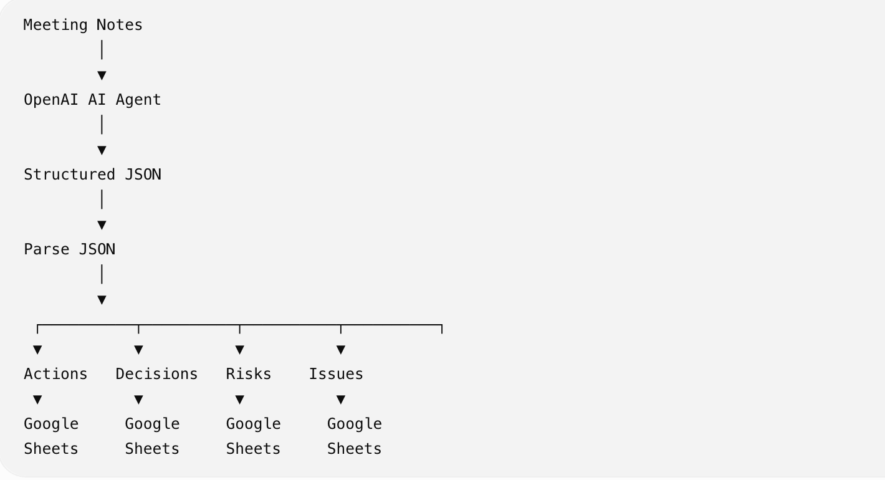
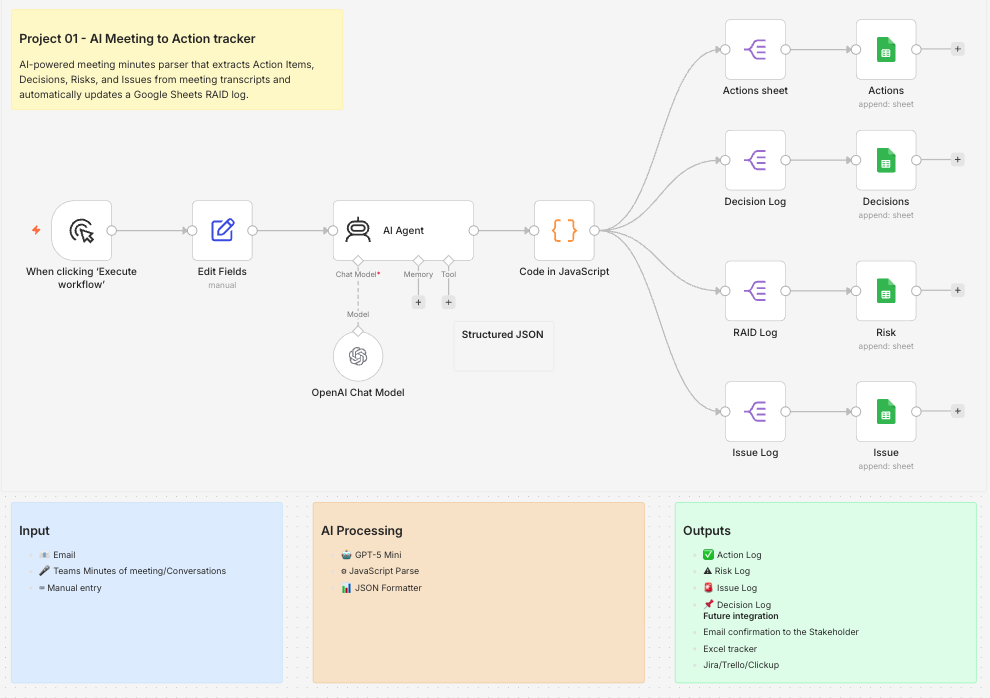
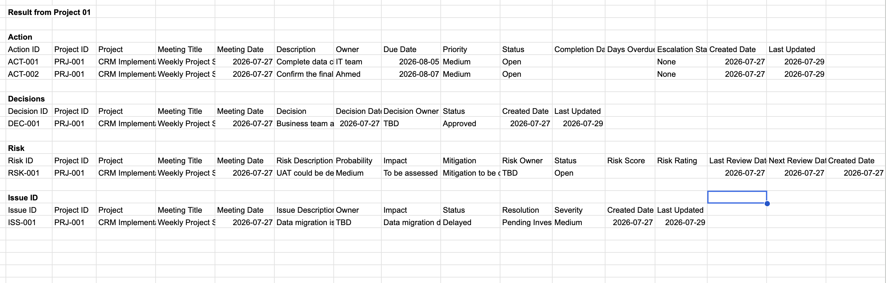

# Project 01 – AI Meeting-to-Action Tracker

| **Status** | ✅ Completed |
|------------|--------------|
| **Version** | 1.0 |
| **Category** | AI Workflow Automation |
| **Platform** | n8n + OpenAI GPT-5 Mini |
| **Development Environment** | Docker Desktop (Local) |

---

# 1. Overview

The **AI Meeting-to-Action Tracker** is an AI-powered workflow built using **n8n**, **OpenAI GPT-5 Mini**, **JavaScript**, and **Google Sheets** that automates the extraction of project governance information from meeting minutes.

Instead of manually reviewing meeting notes and updating RAID logs, the workflow analyzes meeting content using an AI model, converts the response into structured JSON, and automatically updates a centralized **AI PMO RAID Register** stored in Google Sheets.

The solution extracts and maintains dedicated registers for:

- Action Items
- Decisions
- Risks
- Issues

This project demonstrates how Large Language Models (LLMs) can automate repetitive PMO activities while improving consistency, governance, and traceability.

---

# 2. Key Features

- AI-powered meeting minutes analysis
- Automatic Action Item extraction
- Automatic Decision extraction
- Automatic Risk extraction
- Automatic Issue extraction
- Structured JSON generation
- JavaScript data transformation
- Google Sheets integration
- AI PMO RAID Register
- Modular workflow design
- Easily extendable to Jira, Microsoft Teams, SharePoint, Power BI and ClickUp

---

# 3. Business Problem

Project Managers and PMOs spend significant time reviewing meeting minutes and manually updating governance documents including:

- Action Logs
- Decision Logs
- Risk Registers
- Issue Registers

This manual process:

- Consumes valuable project management time
- Produces inconsistent documentation
- Introduces human error
- Delays stakeholder reporting
- Creates outdated RAID logs
- Reduces project visibility

---

# 4. Business Value

This solution enables organizations to:

- Reduce manual documentation effort
- Standardize RAID management
- Improve governance consistency
- Increase accountability
- Accelerate stakeholder reporting
- Create structured project data for future AI analysis

---

# 5. Solution Components

The solution consists of five major components:

1. n8n Workflow
2. OpenAI GPT-5 Mini
3. JavaScript JSON Processing
4. AI PMO RAID Register (Google Sheets)
5. GitHub Repository

The Google Sheets workbook acts as the centralized project governance repository and will be reused by future AI PMO automation projects.

---

# 6. Solution Architecture



Workflow:

1. Capture meeting information
2. Send meeting minutes to GPT-5 Mini
3. Extract Actions, Decisions, Risks and Issues
4. Convert AI response into structured JSON
5. Generate unique record identifiers
6. Update the AI PMO RAID Register

---

# 7. Workflow Diagram



## Workflow Steps

1. Manual Trigger
2. Edit Fields
3. OpenAI GPT-5 Mini
4. AI Agent
5. JavaScript Parser
6. Generate Record IDs
7. Update Actions Sheet
8. Update Decisions Sheet
9. Update Risks Sheet
10. Update Issues Sheet

---

# 8. Project Statistics

| Metric | Value |
|---------|------:|
| Workflow Nodes | 11 |
| AI Model | GPT-5 Mini |
| Programming Language | JavaScript |
| Integrations | Google Sheets |
| Output Registers | 4 |
| Development Environment | Docker + n8n |

---

# 9. Execution Flow

```text
Meeting Minutes
        │
        ▼
Edit Fields
(Project Metadata)
        │
        ▼
OpenAI GPT-5 Mini
        │
        ▼
Structured JSON
        │
        ▼
JavaScript Processing
        │
        ▼
AI PMO RAID Register
        │
        ├── Actions
        ├── Decisions
        ├── Risks
        └── Issues
```

---

# 10. Tech Stack

| Technology | Purpose |
|------------|---------|
| n8n | Workflow Automation |
| OpenAI GPT-5 Mini | AI Information Extraction |
| JavaScript | JSON Processing |
| Google Sheets | RAID Register |
| Docker Desktop | Local Development |
| GitHub | Version Control |

---

# 11. Google Sheets Structure

## Actions

| Column |
|---------|
| Action ID |
| Project ID |
| Project |
| Meeting Title |
| Meeting Date |
| Description |
| Owner |
| Due Date |
| Priority |
| Status |
| Completion Date |
| Days Overdue |
| Escalation Status |
| Created Date |
| Last Updated |

---

## Decisions

| Column |
|---------|
| Decision ID |
| Project ID |
| Project |
| Meeting Title |
| Meeting Date |
| Decision |
| Decision Date |
| Decision Owner |
| Status |
| Created Date |
| Last Updated |

---

## Risks

| Column |
|---------|
| Risk ID |
| Project ID |
| Project |
| Meeting Title |
| Meeting Date |
| Risk Description |
| Probability |
| Impact |
| Mitigation |
| Risk Owner |
| Status |
| Risk Score |
| Risk Rating |
| Last Review Date |
| Next Review Date |
| Created Date |
| Last Updated |

---

## Issues

| Column |
|---------|
| Issue ID |
| Project ID |
| Project |
| Meeting Title |
| Meeting Date |
| Issue Description |
| Owner |
| Impact |
| Status |
| Resolution |
| Severity |
| Created Date |
| Last Updated |

---

# 12. Repository Structure

```text
01-ai-meeting-to-action-tracker/
│
├── README.md
├── LICENSE
│
├── images/
│   ├── architecture.png
│   ├── workflow.png
│   ├── ai-output.png
│   ├── workflow-execution.png
│   └── google-sheets-output.png
│
└── workflow/
    └── meeting-to-action.json
```

---

# 13. n8n Workflow

Workflow Nodes

- Manual Trigger
- Edit Fields
- OpenAI Chat Model
- AI Agent
- JavaScript Parser
- Google Sheets – Actions
- Google Sheets – Decisions
- Google Sheets – Risks
- Google Sheets – Issues

Workflow Export

```text
workflow/meeting-to-action.json
```

---

# 14. Sample Input

```text
CRM implementation is progressing well.

John will finalize the API integration by Friday.

The steering committee approved the revised implementation schedule.

There is a risk that the vendor may delay hardware delivery.

Issue:
Test environment credentials are still unavailable.
```

---

# 15. Sample AI Output

```json
{
  "project": "CRM Implementation",
  "meeting_title": "Weekly Project Status Meeting",
  "meeting_date": "2026-07-27",
  "action_items": [
    {
      "description": "Finalize API integration",
      "owner": "John",
      "due_date": "2026-08-01",
      "priority": "High",
      "status": "Open"
    }
  ],
  "decisions": [
    {
      "decision": "Approved revised implementation schedule",
      "date": "2026-07-27"
    }
  ],
  "risks": [
    {
      "description": "Vendor hardware delivery may delay testing",
      "probability": "Medium",
      "impact": "Testing schedule may slip",
      "mitigation": "Closely monitor supplier deliveries"
    }
  ],
  "issues": [
    {
      "description": "Test environment credentials unavailable",
      "owner": "Infrastructure Team",
      "impact": "Testing cannot begin",
      "status": "Open"
    }
  ]
}
```

---

# 16. Google Sheets Output

The workflow automatically updates the centralized **AI PMO RAID Register**, consisting of:

- ✅ Actions
- ✅ Decisions
- ✅ Risks
- ✅ Issues

```markdown

```

---

# 17. Skills Demonstrated

- AI Workflow Automation
- Prompt Engineering
- Large Language Models (LLMs)
- n8n Workflow Development
- JavaScript
- JSON Processing
- Google Workspace Integration
- Process Automation
- PMO Governance
- Docker
- Git & GitHub
- AI Solution Design

---

# 18. Lessons Learned

This project provided practical experience in:

- Designing AI-powered workflows
- Prompt engineering for structured outputs
- Transforming AI responses into JSON
- Integrating OpenAI with Google Sheets
- Creating reusable workflow components
- Building scalable PMO automation
- Version controlling AI workflows using GitHub

---

# 19. Future Improvements

Future enhancements include:

- Microsoft Teams transcript ingestion
- Voice recording transcription
- Outlook email integration
- Automated meeting summaries
- Jira integration
- ClickUp integration
- Monday.com integration
- SharePoint integration
- Power BI dashboards
- AI confidence scoring
- Duplicate action detection
- Automatic owner notifications
- Due-date reminders

---

# 20. Next Project

## Project 02 – AI RAID Log Automation

Project 02 extends this solution by using the **AI PMO RAID Register** created in Project 01 to:

- Monitor overdue actions
- Detect stale risks and issues
- Calculate governance metrics
- Generate executive RAID reports
- Recommend AI-powered mitigation actions
- Produce project health insights

---

# 21. Author

**Syed A Aziz**

AI PMO Automation Portfolio

Dubai, United Arab Emirates

---

# Portfolio

This project is part of the **AI PMO Automation Portfolio**, a collection of practical AI-powered automation solutions demonstrating how Large Language Models can improve Project Management Office (PMO) processes through workflow automation, intelligent information extraction, governance automation, and executive reporting.