# Project 02 – AI RAID Log Automation

## 1. Overview

The **AI RAID Log Automation** workflow is an AI-powered PMO governance solution built using n8n, OpenAI, Google Sheets, Gmail, JavaScript, and Docker.

The workflow analyzes project updates and automatically identifies:

- Risks
- Assumptions
- Issues
- Dependencies

It then applies structured governance logic to generate record IDs, calculate risk scores, prevent duplicate entries, update a centralized RAID register, escalate High and Critical risks, and suppress repeated email alerts.

---

## 2. Business Problem

Project managers regularly review meeting minutes, status reports, emails, and stakeholder updates to identify information that could affect project delivery.

This process is often manual and creates several problems:

- Risks and issues may be identified late
- RAID registers may not be updated consistently
- Duplicate records may be created
- Risk ratings may be subjective
- Owners and mitigation actions may be missing
- Critical risks may not be escalated quickly
- Repeated notifications may create alert fatigue
- Governance processes depend heavily on manual follow-up

A poorly maintained RAID register reduces project visibility and weakens management decision-making.

---

## 3. Solution

The workflow receives an unstructured project update and sends it to an OpenAI model for analysis.

The AI extracts Risks, Assumptions, Issues, and Dependencies in structured JSON format.

The workflow then:

1. Parses and validates the AI response.
2. Splits each RAID category into a separate processing branch.
3. Generates unique record IDs.
4. Creates stable duplicate-detection keys.
5. Calculates risk scores and ratings.
6. Appends new records or updates existing records.
7. Assigns review dates.
8. Identifies High and Critical risks.
9. Checks whether an alert was previously sent.
10. Sends an email only when a new escalation is required.
11. Records the alert in an Alert Log.

---

## 4. Business Value

The solution provides the following business benefits:

- Faster identification of project threats
- Consistent RAID classification
- Reduced manual data entry
- Standardized risk scoring
- Prevention of duplicate RAID records
- Faster escalation of serious risks
- Improved auditability
- Centralized governance information
- Reduced notification fatigue
- Better visibility for project managers and stakeholders

---

## 5. Solution Architecture

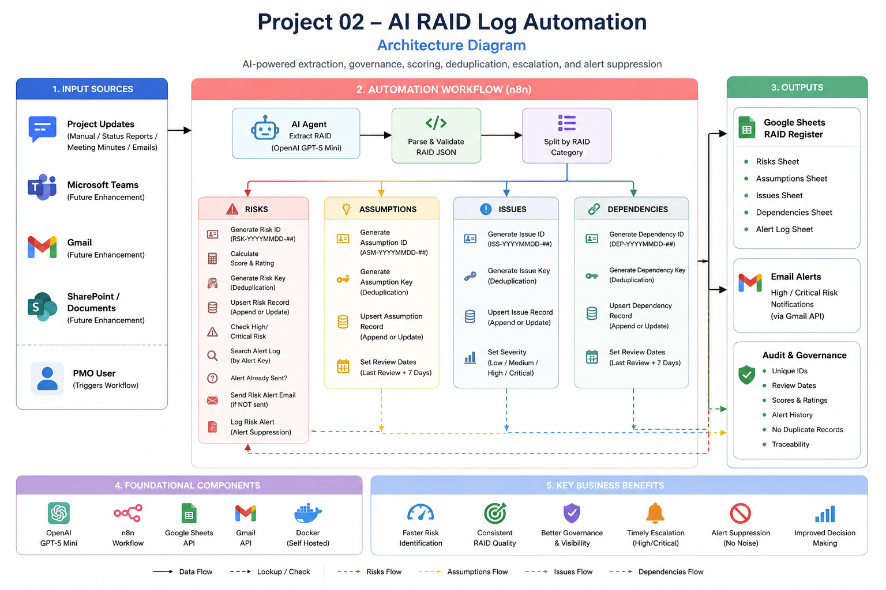

The architecture separates the solution into four layers:

1. **Input Sources** – project updates are currently supplied through a manual test input, with Teams, Gmail, SharePoint, status reports, and meeting minutes identified as future ingestion sources.
2. **Automation Workflow** – n8n orchestrates OpenAI RAID extraction, JSON parsing, category splitting, deterministic scoring, duplicate-key generation, record upserts, escalation checks, and alert suppression.
3. **Outputs and Governance** – Google Sheets stores the RAID registers and Alert Log, while Gmail sends High/Critical risk notifications. IDs, review dates, scores, ratings, alert history, and deduplication provide the governance controls.
4. **Foundational Components** – OpenAI, n8n, Google Sheets API, Gmail API, and Docker provide the underlying automation stack.

The architecture combines AI interpretation with deterministic workflow controls so that model output is validated and governed before it becomes an operational RAID record or escalation.

---

## 6. Workflow Diagram

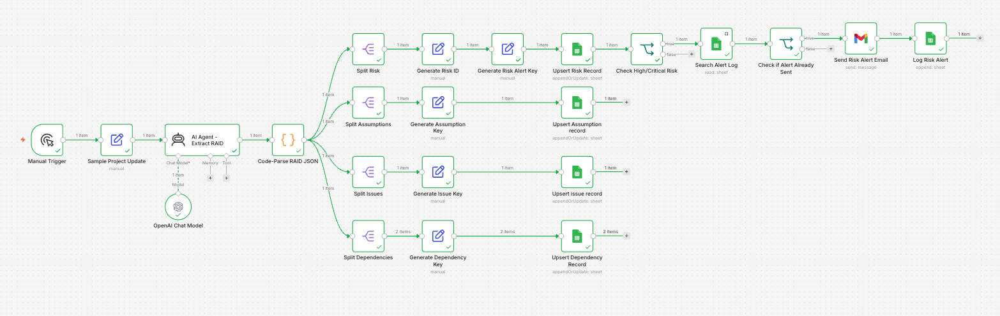

The workflow contains one central AI extraction process and four separate RAID processing branches.

```text
Manual Trigger
      ↓
Sample Project Update
      ↓
AI Agent – Extract RAID
      ↓
Parse RAID JSON
      │
      ├── Risk Processing
      ├── Assumption Processing
      ├── Issue Processing
      └── Dependency Processing
```

---

## 7. Technology Stack

- n8n
- OpenAI GPT-5 Mini
- Google Sheets API
- Gmail API
- Google OAuth 2.0
- JavaScript
- Docker
- GitHub

---

## 8. Sample Project Update

The workflow currently uses a manual sample input for testing.

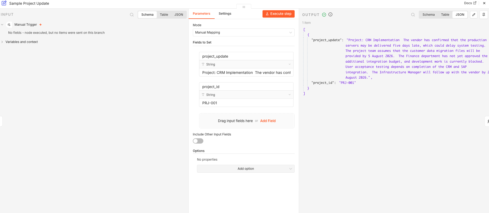

```text
Project: CRM Implementation

The vendor has confirmed that the production servers may be delivered five days late, which could delay system testing.

The project team assumes that the customer data migration files will be provided by 5 August 2026.

The Finance department has not yet approved the additional integration budget, and development work is currently blocked.

User acceptance testing depends on completion of the CRM and SAP integration.

The Infrastructure Manager will follow up with the vendor by 2 August 2026.
```

The sample update contains:

- One risk
- One assumption
- One issue
- One dependency

---

## 9. AI RAID Extraction

The AI Agent analyzes the project update and returns structured JSON.

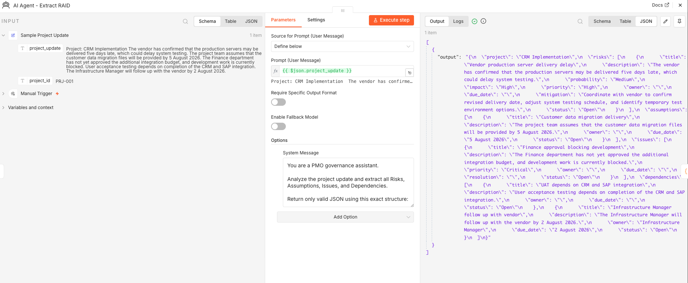

The expected output structure is:

```json
{
  "project": "CRM Implementation",
  "risks": [
    {
      "title": "Production servers may be delivered late",
      "description": "The vendor has confirmed that the production servers may be delivered five days late.",
      "probability": "Medium",
      "impact": "High",
      "priority": "High",
      "owner": "Infrastructure Manager",
      "due_date": "2026-08-02",
      "mitigation": "Follow up with the vendor and adjust the testing schedule if required.",
      "status": "Open"
    }
  ],
  "assumptions": [
    {
      "title": "Customer data migration files delivery",
      "description": "The project team assumes that the migration files will be provided by 5 August 2026.",
      "owner": "Project team",
      "due_date": "2026-08-05",
      "status": "Open"
    }
  ],
  "issues": [
    {
      "title": "Integration budget approval pending",
      "description": "The integration budget has not been approved and development is blocked.",
      "priority": "Critical",
      "owner": "Finance department",
      "due_date": "",
      "resolution": "Obtain Finance approval to unblock development.",
      "status": "Open"
    }
  ],
  "dependencies": [
    {
      "title": "UAT depends on CRM-SAP integration",
      "description": "User acceptance testing depends on completion of the CRM and SAP integration.",
      "owner": "",
      "due_date": "",
      "status": "Open"
    }
  ]
}
```

---

## 10. JSON Parsing

The AI response is returned as a JSON string and must be converted into structured workflow data.

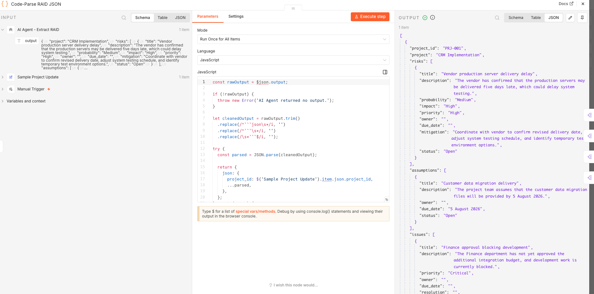

The Code node:

- Removes markdown code blocks if present
- Validates the JSON response
- Parses the JSON
- Preserves the Project ID
- Makes the RAID arrays available to downstream nodes

The parsed output contains:

```text
project_id
project
risks
assumptions
issues
dependencies
```

---

## 11. Risk Processing

### 11.1 Split Risk

The Risk branch separates each extracted risk into an individual workflow item.

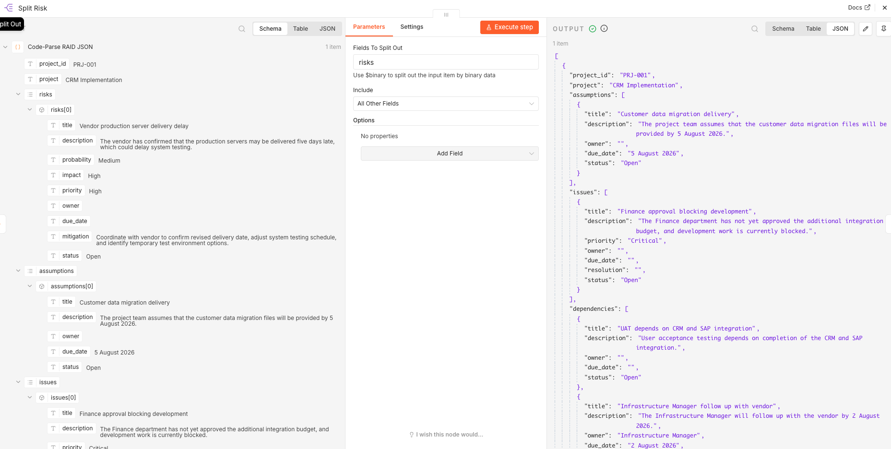

### 11.2 Generate Risk ID, Score, Rating and Key

The workflow generates a unique Risk ID using:

- Risk prefix
- Timestamp
- Item index

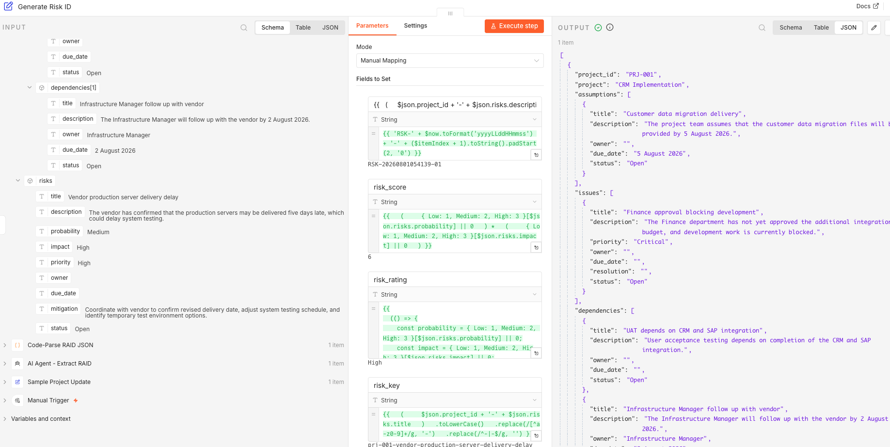

Example:

```text
RSK-20260730141604-01
```

The same node also calculates Risk Score, Risk Rating, and Risk Key.

### 11.3 Risk Scoring

| Rating | Numeric Value |
|---|---:|
| Low | 1 |
| Medium | 2 |
| High | 3 |

```text
Risk Score = Probability × Impact
```

Example:

```text
Probability = Medium = 2
Impact = High = 3
Risk Score = 2 × 3 = 6
```

### 11.4 Risk Rating Matrix

| Risk Score | Risk Rating |
|---:|---|
| 1–2 | Low |
| 3–4 | Medium |
| 6 | High |
| 9 | Critical |

The final Risk Rating is calculated by deterministic workflow logic rather than relying only on the AI-generated priority.

### 11.5 Duplicate Detection

Generated IDs change on each execution, so they are not used for duplicate detection. The workflow instead creates a stable Risk Key from the Project ID and normalized risk content.

The Google Sheets operation is configured as:

```text
Append or Update Row
```

```text
Risk Key exists → Update the existing row
Risk Key does not exist → Append a new row
```

### 11.6 Generate Risk Alert Key

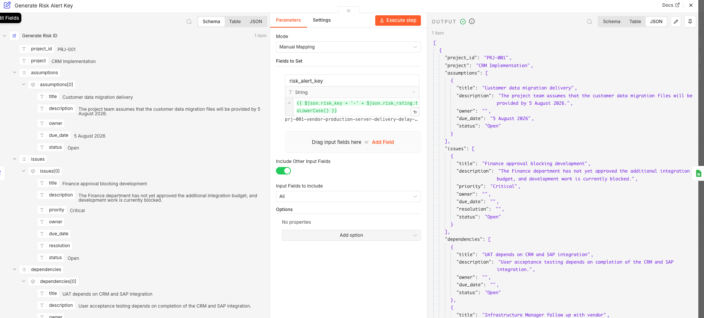

The Alert Key combines:

```text
Risk Key + Risk Rating
```

This supports alert suppression while still allowing a new notification if the risk rating changes.

### 11.7 Upsert Risk Record

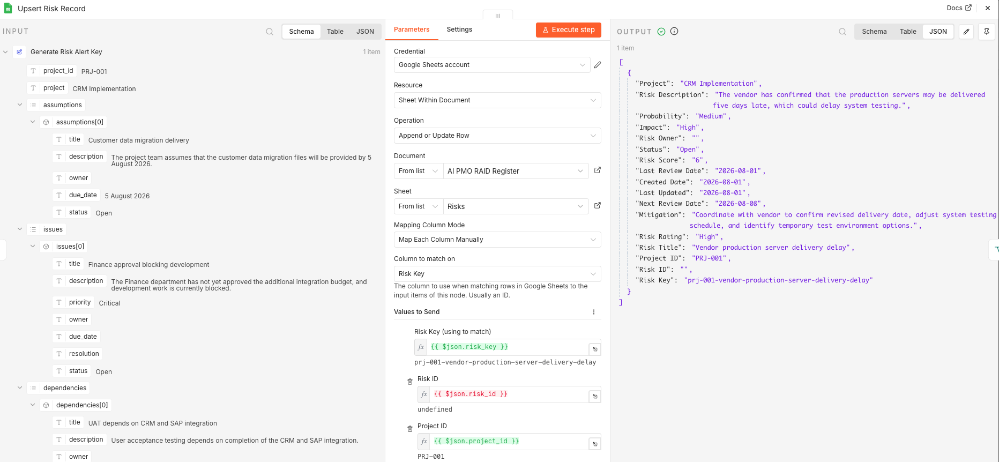

The Risks sheet stores the risk ID, key, project information, title, description, probability, impact, score, rating, owner, mitigation, status, and review dates.

### 11.8 Review Date Automation

```text
Last Review Date = Current Date
Next Review Date = Current Date + 7 Days
```

### 11.9 High and Critical Risk Check

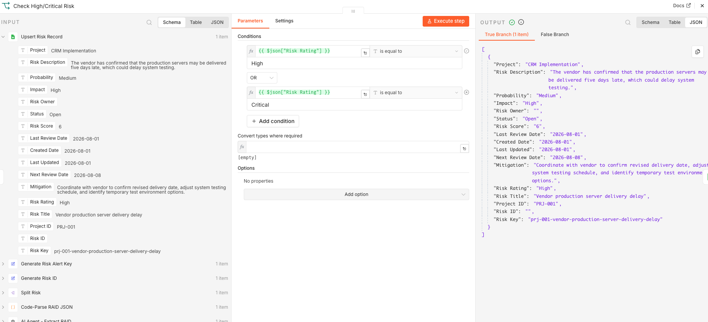

```text
Risk Rating = High
OR
Risk Rating = Critical
```

### 11.10 Search Alert Log

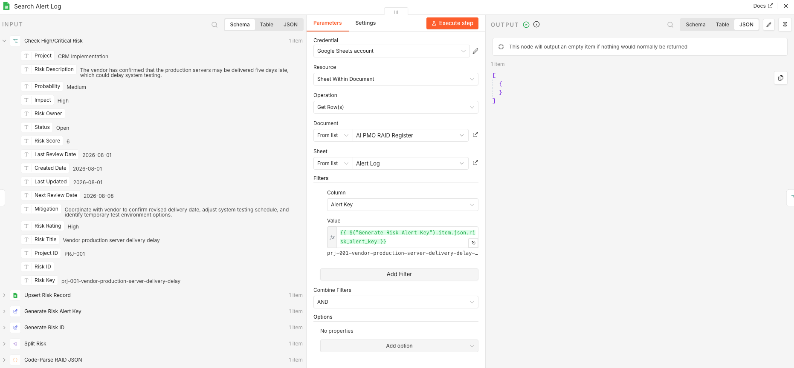

Before sending an email, the workflow searches the Alert Log for the generated Alert Key.

### 11.11 Check if Alert Was Already Sent

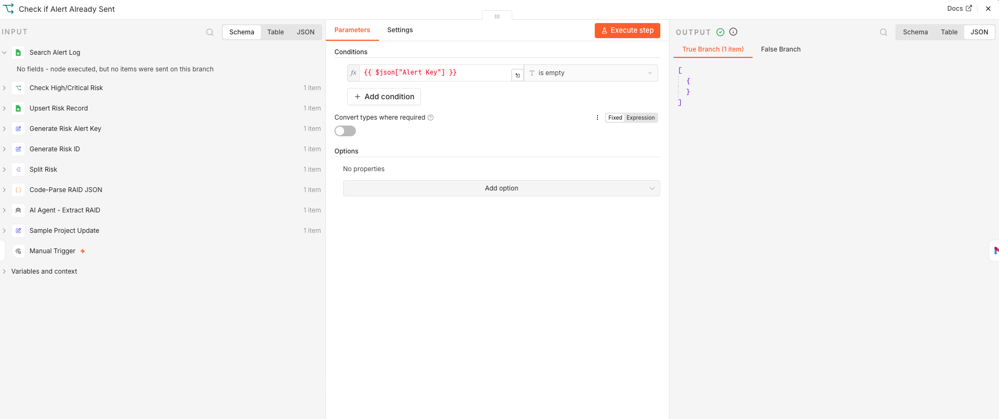

```text
Alert Key is empty → Send email
Alert Key exists → Stop notification path
```

### 11.12 Send Risk Alert Email

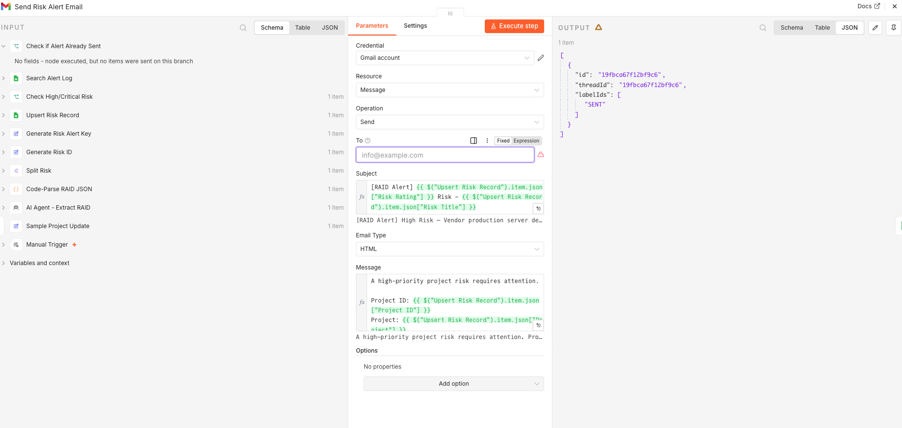

The email includes the project, risk ID, title, description, probability, impact, score, rating, owner, mitigation, status, and next review date.

### 11.13 Log Risk Alert

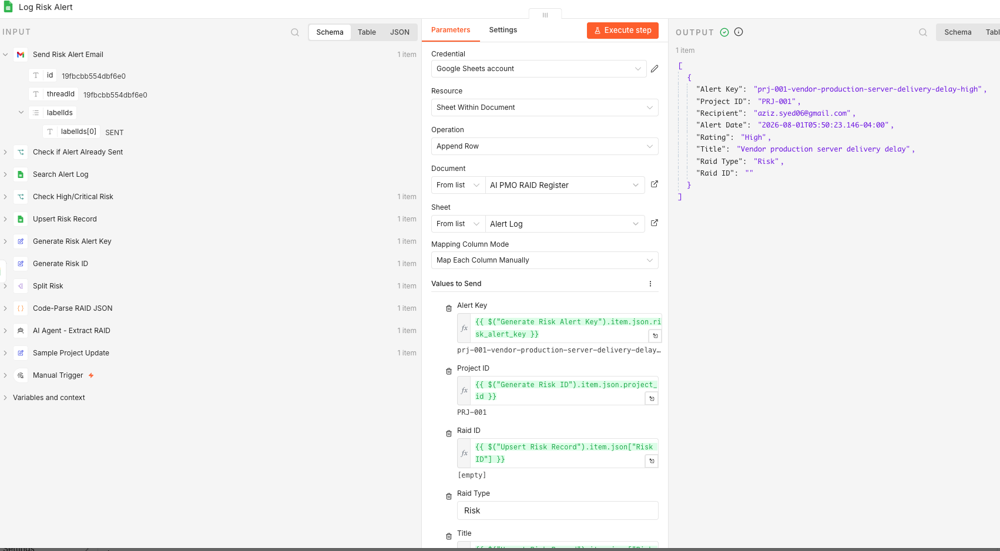

The Alert Log stores:

```text
Alert Key
Project ID
RAID ID
RAID Type
Title
Rating
Alert Date
Recipient
```

---

## 12. Assumption Processing

### 12.1 Split Assumptions

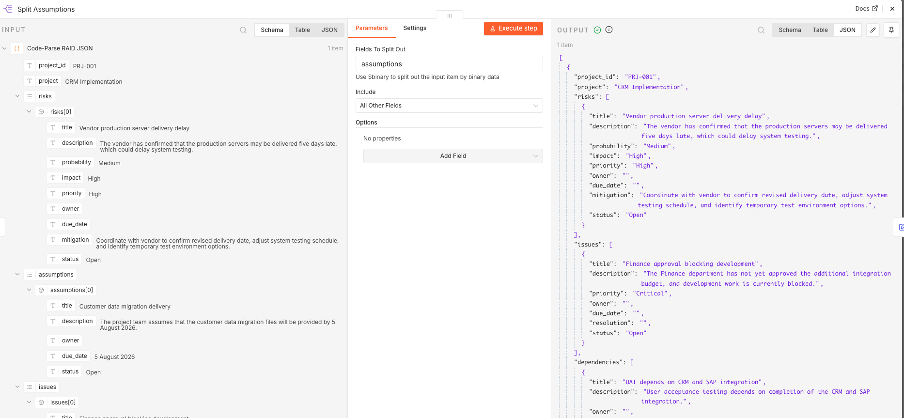

### 12.2 Generate Assumption ID and Key

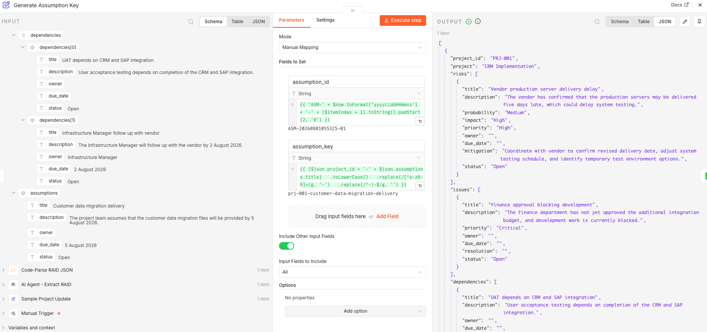

Example:

```text
ASM-20260730140402-01
```

### 12.3 Upsert Assumption Record

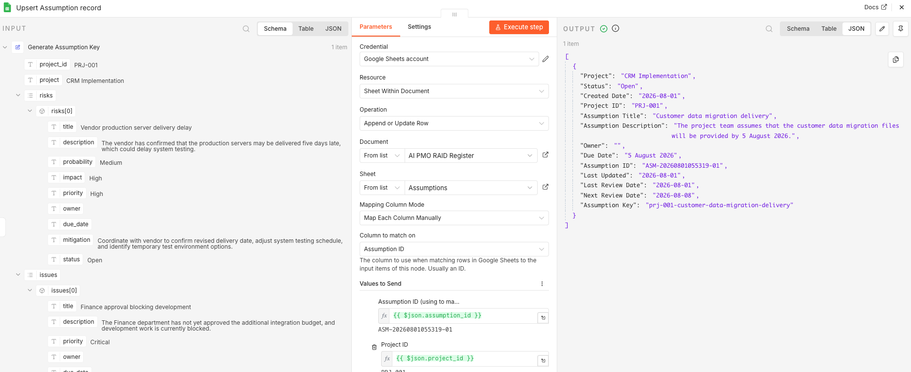

The Assumptions sheet stores the Assumption ID, duplicate key, Project ID, title, description, owner, due date, status, review dates, and audit dates.

---

## 13. Issue Processing

### 13.1 Split Issues

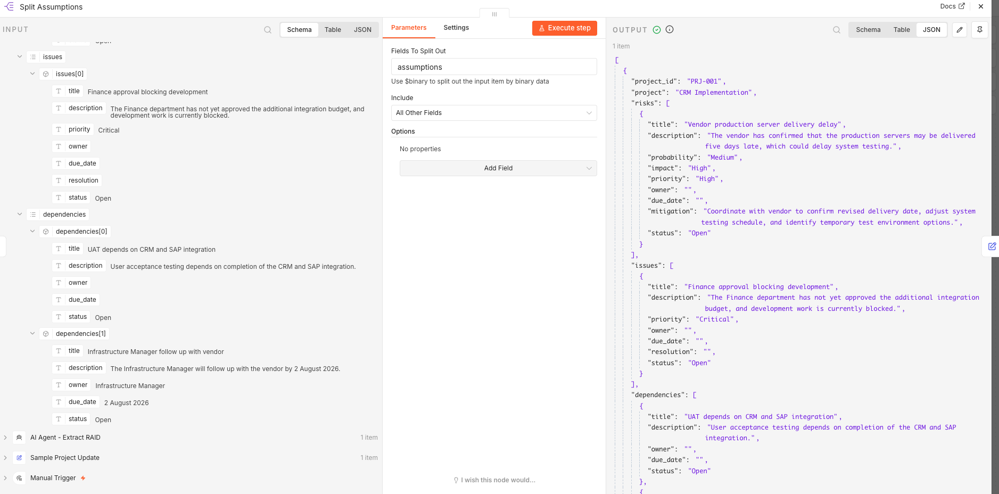

### 13.2 Generate Issue ID and Key

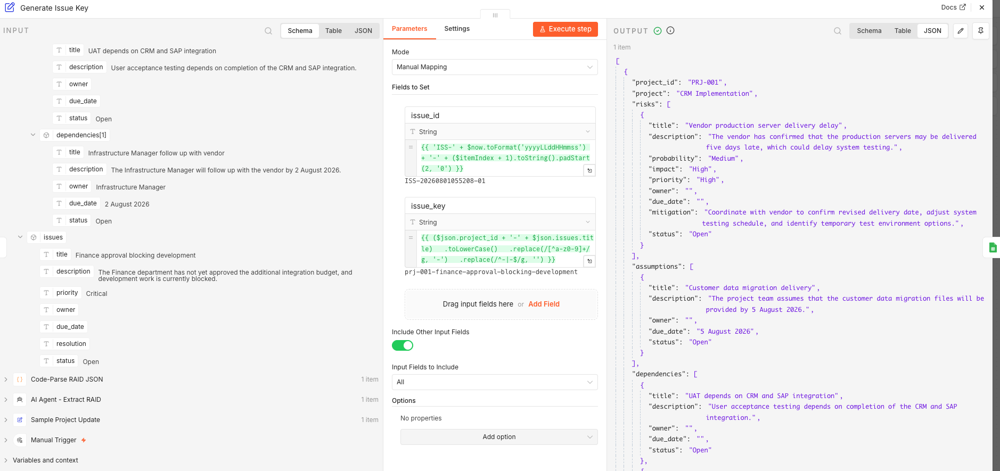

Example:

```text
ISS-20260730140405-01
```

### 13.3 Upsert Issue Record

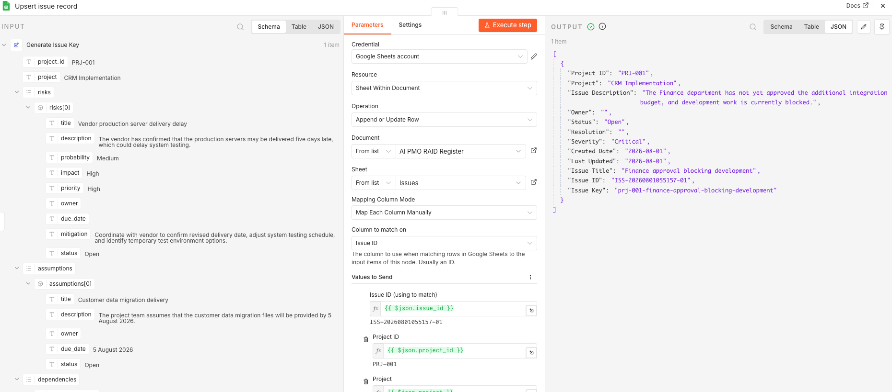

The Issues sheet stores the Issue ID, duplicate key, Project ID, title, description, owner, status, resolution, severity, and audit dates.

---

## 14. Dependency Processing

### 14.1 Split Dependencies

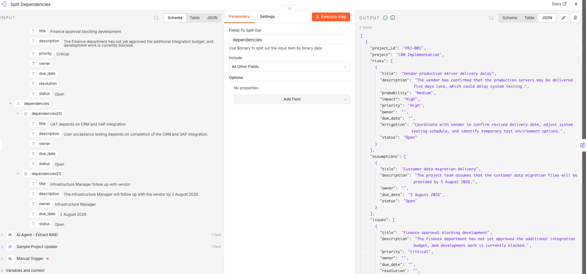

### 14.2 Generate Dependency ID and Key

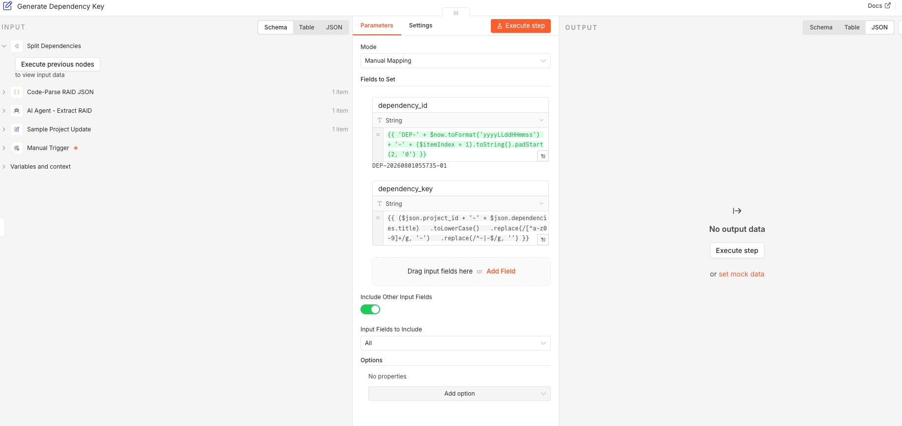

Example:

```text
DEP-20260730140407-01
```

### 14.3 Upsert Dependency Record

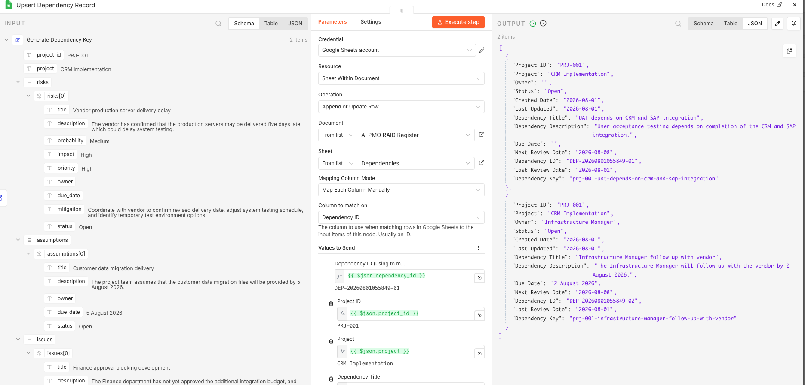

The Dependencies sheet stores the Dependency ID, duplicate key, Project ID, title, description, owner, due date, status, review dates, and audit dates.

---

## 15. Google Sheets Structure

The RAID workbook contains:

```text
Risks
Assumptions
Issues
Dependencies
Alert Log
```

The Alert Log provides the audit trail used to prevent repeated notifications.

---

## 16. Alert Suppression Logic

```text
High or Critical Risk
      ↓
Generate Alert Key
      ↓
Search Alert Log
      ↓
Alert Key Found?
```

```text
No → Send email → Log alert
Yes → Do not send another email
```

If the risk rating changes, a new Alert Key is generated and a new escalation can be sent.

---

## 17. Workflow Testing

### 17.1 First Execution

Expected results:

- RAID records created
- Risk Score calculated
- Risk Rating calculated
- High/Critical risk email sent
- Alert Log record created

### 17.2 Second Execution

Expected results:

- Existing RAID records updated
- No duplicate RAID rows created
- Existing Alert Key detected
- No duplicate email sent
- No duplicate Alert Log row created

The repeat-execution test confirmed both record deduplication and alert suppression.

---

## 18. Repository Structure

```text
Project-02-AI-RAID-Log-Automation/
│
├── README.md
├── workflow/
│   └── project-02-ai-raid-log-automation.json
│
├── images/
│   ├── architecture.png
│   ├── workflow.png
│   ├── setup/
│   ├── risks/
│   ├── assumptions/
│   ├── issues/
│   └── dependencies/
│
├── prompts/
│   └── raid-extraction-prompt.txt
│
└── samples/
    ├── sample-project-update.txt
    └── sample-ai-output.json
```

---

## 19. Key Skills Demonstrated

- AI workflow automation
- PMO governance
- RAID management
- Risk scoring
- Risk escalation
- Structured JSON processing
- Duplicate detection
- Google Sheets integration
- Gmail API integration
- OAuth 2.0 configuration
- JavaScript expressions
- Conditional routing
- Alert suppression
- n8n workflow design
- Data-quality management

---

## 20. Current Limitations

- The workflow currently uses a Manual Trigger
- AI classification may still require human validation
- Owners remain blank when not specified in the source
- Only High and Critical risks currently trigger email alerts
- Duplicate detection depends on normalized text keys
- Google Sheets is suitable for a prototype but not a high-volume enterprise implementation

---

## 21. Future Improvements

- Microsoft Teams transcript ingestion
- Gmail project-update ingestion
- SharePoint document processing
- Weekly status-report ingestion
- High and Critical issue alerts
- Automatic overdue-item detection
- Stale RAID item reminders
- Risk ageing analysis
- Executive RAID summaries
- Scheduled weekly RAID reports
- Power BI dashboard integration
- Project master-data validation
- Named-owner escalation
- Human approval before record creation
- Database storage instead of Google Sheets

---

## 22. Lessons Learned

This project demonstrated that AI extraction alone is not enough for a reliable PMO automation solution.

A governed workflow also requires:

- Structured data validation
- Stable duplicate keys
- Record deduplication
- Deterministic risk scoring
- Controlled escalation rules
- Alert history
- Notification suppression
- Consistent naming
- Audit information

The project combines AI interpretation with deterministic business rules to create a more reliable governance workflow.

---

## 23. Conclusion

The AI RAID Log Automation workflow converts raw project updates into structured and governed RAID records.

It combines:

```text
AI Extraction
+ PMO Governance
+ Risk Scoring
+ Duplicate Prevention
+ Automated Escalation
+ Alert Suppression
```

The result is a practical PMO automation prototype that demonstrates structured AI extraction, deterministic controls, deduplication, escalation logic, and auditable alert handling.
