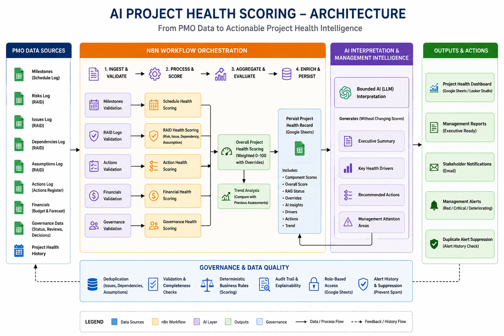
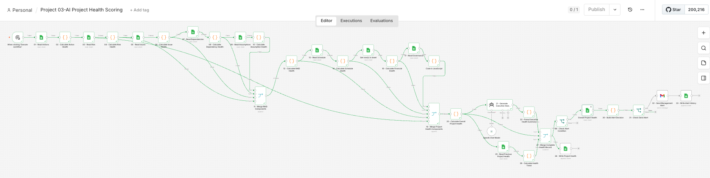
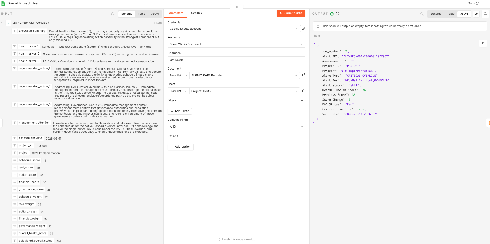
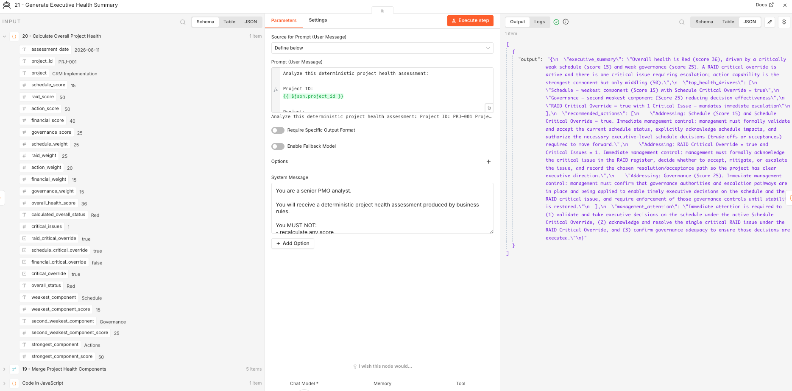
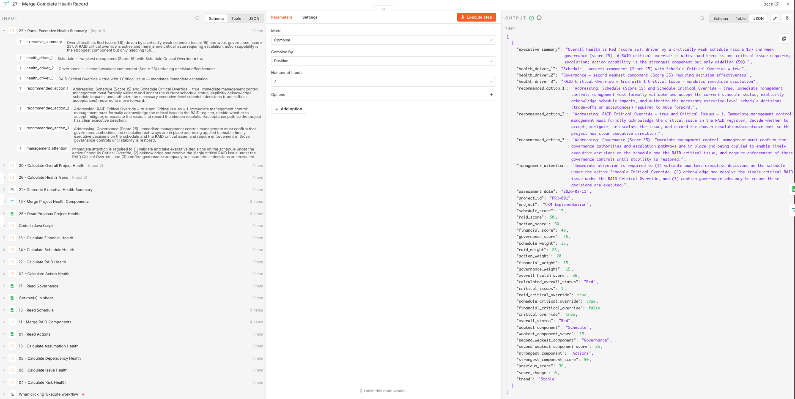
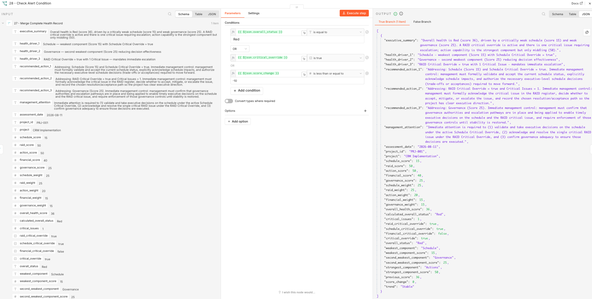

# Project 03 – AI Project Health Scoring

## 1. Overview

The AI Project Health Scoring workflow is an n8n-based PMO automation solution that evaluates project health using deterministic scoring logic across multiple project-control dimensions.

The workflow converts operational project data into:

- Component health scores
- Consolidated RAID Health
- Overall Project Health Score
- RAG status
- Critical override conditions
- Historical health trend
- AI-generated executive interpretation
- Conditional management alerts
- Duplicate-alert suppression

A key design principle is that **AI does not calculate or alter project health scores**.

All scoring is performed using deterministic JavaScript business rules. AI is used only to interpret the calculated result for management.

---

## 2. Business Problem

Project health reporting is often subjective and dependent on manual interpretation.

Common challenges include:

- Inconsistent RAG assessments
- Different scoring approaches between project managers
- Duplicate RAID records affecting reporting accuracy
- Delayed identification of schedule deterioration
- Weak visibility of governance issues
- Manual executive-summary preparation
- Repeated alerts for unchanged conditions
- Limited visibility into project-health trends

The objective of this project was to create a repeatable, transparent, and auditable project-health assessment workflow.

---

## 3. Solution Architecture

The solution separates deterministic scoring from generative AI.



High-level flow:

```text
PMO Source Data
      ↓
n8n Data Collection
      ↓
Deterministic Scoring Engine
      ↓
Component Health Scores
      ↓
Overall Project Health
      ↓
Critical Override Logic
      ↓
Bounded AI Interpretation
      ↓
Historical Trend Analysis
      ↓
Project Health Repository
      ↓
Conditional Alerting
      ↓
Duplicate Alert Suppression
```

---

## 4. n8n Workflow



The workflow reads PMO data from Google Sheets, calculates individual health dimensions, aggregates them into an overall score, interprets the result using AI, tracks changes over time, and triggers management alerts when required.

---

## 5. Technology Stack

* n8n
* JavaScript
* OpenAI / AI model
* Google Sheets
* Gmail
* Docker
* Google OAuth
* GitHub

---

## 6. Health Scoring Model

The overall Project Health Score uses five weighted dimensions:

| Health Dimension  |   Weight |
| ----------------- | -------: |
| Schedule Health   |      25% |
| RAID Health       |      25% |
| Action Health     |      20% |
| Financial Health  |      15% |
| Governance Health |      15% |
| **Total**         | **100%** |

Overall score calculation:

```javascript
const overallScore =
  scheduleScore * 0.25 +
  raidScore * 0.25 +
  actionScore * 0.20 +
  financialScore * 0.15 +
  governanceScore * 0.15;
```

---

## 7. RAG Classification

The workflow assigns project health using deterministic thresholds:

```text
Green: 80–100
Amber: 60–79
Red:   0–59
```

Critical conditions can override the calculated RAG status.

---

## 8. Action Health

Action Health evaluates:

* Open actions
* Overdue actions
* Overdue percentage
* High-priority overdue actions
* Actions without owners

Example test result:

```text
Total Actions: 1
Open Actions: 1
Overdue Actions: 1
Overdue Percentage: 100%
Action Health Score: 50
```

---

## 9. Risk Health

Risk Health evaluates:

* Open risks
* High or critical risks
* Missing mitigation
* Stale review dates

Example:

```text
Total Risks: 2
Open Risks: 2
High Risks: 2
Risks Without Mitigation: 1
Stale Risks: 2
Risk Health Score: 50
```

---

## 10. Issue Health and Deduplication

Issue records are deduplicated using `Issue Key` before scoring.

This prevents duplicate records from artificially reducing project health.

Example:

```text
Source Issue Rows: 2
Unique Issues: 1
Duplicates Removed: 1
Critical Issues: 1
Issues Without Owner: 1
Stale Issues: 1
Issue Health Score: 50
```

---

## 11. Dependency Health

Dependency records are deduplicated using `Dependency Key`.

The workflow evaluates:

* Overdue dependencies
* Missing due dates
* Missing owners
* Stale dependencies

Example:

```text
Source Dependency Rows: 4
Unique Dependencies: 2
Duplicates Removed: 2
Overdue Dependencies: 1
Dependencies Without Due Date: 1
Dependencies Without Owner: 1
Stale Dependencies: 2
Dependency Health Score: 50
```

---

## 12. Assumption Health

Assumption records are deduplicated using `Assumption Key`.

The workflow evaluates:

* Overdue assumptions
* Missing owners
* Missing validation results
* Stale assumptions

Example:

```text
Source Assumption Rows: 3
Unique Assumptions: 1
Duplicates Removed: 2
Overdue Assumptions: 1
Unvalidated Assumptions: 1
Stale Assumptions: 1
Assumption Health Score: 45
```

---

## 13. Consolidated RAID Health

RAID Health combines four health dimensions:

| RAID Component | Weight |
| --------------- | -----: |
| Risk             |    35% |
| Issue            |    35% |
| Dependency       |    20% |
| Assumption       |    10% |

Example:

```text
Risk Score:        50
Issue Score:       50
Dependency Score:  50
Assumption Score:  45

RAID Health Score: 50
RAID Status:       Red
```

A critical unresolved issue can also trigger a RAID critical override.

---

## 14. Schedule Health

Schedule Health evaluates milestone performance using:

* Planned dates
* Actual dates
* Forecast dates
* Completion status
* Critical-path designation

The workflow calculates:

* Open milestones
* Overdue milestones
* Overdue percentage
* Critical-path overdue milestones
* Forecast-delayed milestones
* Average forecast delay
* Maximum forecast delay
* Completed milestones delivered late

Example:

```text
Total Milestones: 5
Open Milestones: 4
Overdue Milestones: 3
Overdue Percentage: 75%
Critical Overdue Milestones: 3
Forecast Delayed Milestones: 4
Average Forecast Delay: 7.25 days
Schedule Health Score: 15
Status: Red
```

---

## 15. Timezone Handling

During testing, the workflow initially undercounted overdue milestones because the assessment date used UAE time while the comparison date used the server timezone.

The scoring logic was corrected to use the UAE-local assessment date.

```text
Timezone: Asia/Dubai
```

This prevents near-midnight timezone differences from incorrectly classifying milestones.

---

## 16. Financial Health

Financial Health evaluates:

* Approved Budget
* Actual Cost
* Forecast at Completion
* Forecast budget variance

The workflow independently recalculates budget variance instead of blindly trusting the manually entered percentage.

Example:

```text
Approved Budget: AED 500,000
Actual Cost: AED 410,000
Forecast at Completion: AED 560,000

Calculated Budget Variance: 12%
Supplied Budget Variance: 12%
Variance Mismatch: false

Financial Health Score: 40
Status: Red
```

---

## 17. Governance Health

Governance Health evaluates:

* Status-report timeliness
* RAID review compliance
* Steering Committee compliance
* Pending decisions
* Mandatory-field completeness

Example:

```text
Status Report: 1 day late
RAID Review: Overdue
Steering Committee: Missed
Pending Decisions: 2
Mandatory Fields Complete: No

Governance Health Score: 25
Status: Red
```

---

## 18. Overall Project Health



The test project produced:

```text
Schedule Health:    15
RAID Health:        50
Action Health:      50
Financial Health:   40
Governance Health:  25
```

Weighted calculation:

```text
Schedule      15 × 25% =  3.75
RAID          50 × 25% = 12.50
Actions       50 × 20% = 10.00
Financial     40 × 15% =  6.00
Governance    25 × 15% =  3.75

Overall Health Score = 36
```

Final result:

```text
Overall Health Score: 36
RAG Status: Red
```

---

## 19. Critical Override Logic

A weighted average can hide severe project conditions.

The workflow therefore applies critical override rules.

Example conditions include:

* Active critical RAID issue
* Severely degraded Schedule Health
* Severely degraded Financial Health

Test result:

```text
RAID Critical Override: true
Schedule Critical Override: true
Financial Critical Override: false

Final Critical Override: true
Final Status: Red
```

---

## 20. Weakest Component Analysis

The workflow identifies the weakest project-health areas automatically.

Example:

```text
Weakest Component:
Schedule – 15

Second Weakest:
Governance – 25

Strongest:
Actions – 50
```

These values are passed to the AI interpretation layer.

---

## 21. Bounded AI Executive Interpretation



The AI model receives the deterministic Project Health result but is explicitly prohibited from:

* Recalculating scores
* Changing RAG status
* Changing override flags
* Inventing project facts
* Inventing root causes
* Claiming predictive certainty

The model generates:

* Executive Summary
* Top Health Drivers
* Recommended Actions
* Management Attention

Architecture:

```text
Deterministic Business Rules
        ↓
Auditable Health Scores
        ↓
Bounded AI Interpretation
```

AI therefore supports management communication without controlling the underlying score.

---

## 22. Structured AI Output

The AI response is parsed into structured fields:

```text
executive_summary
health_driver_1
health_driver_2
health_driver_3
recommended_action_1
recommended_action_2
recommended_action_3
management_attention
```

These fields are merged with the deterministic health assessment before persistence.

---

## 23. Project Health Repository

Each assessment is appended to the `Project Health` Google Sheet rather than overwriting previous records.

Stored fields include:

```text
Assessment ID
Assessment Date
Project ID
Project
Schedule Score
RAID Score
Action Score
Financial Score
Governance Score
Overall Health Score
RAG Status
Previous Score
Score Change
Trend
Critical Override
Top Health Driver 1
Top Health Driver 2
Top Health Driver 3
AI Executive Summary
Recommended Action 1
Recommended Action 2
Recommended Action 3
Management Attention
```

---

## 24. Historical Trend Analysis



Before writing a new assessment, the workflow reads the most recent previous Project Health record.

It calculates:

```text
Score Change =
Current Health Score - Previous Health Score
```

Trend classification:

```text
Positive Change → Improving
No Change       → Stable
Negative Change → Deteriorating
```

Test result:

```text
Current Score: 36
Previous Score: 36
Score Change: 0
Trend: Stable
```

This converts the workflow from a one-time health snapshot into a historical monitoring solution.

---

## 25. Conditional Management Alerting

The workflow checks whether management notification is required.

An alert is triggered if:

```text
Overall Status = Red

OR

Critical Override = true

OR

Score Change <= -10
```

---

## 26. Alert Prioritization

Alert conditions are prioritized as follows:

```text
1. Significant Score Deterioration
2. Critical Override
3. Red Status
```

Example:

```text
Alert Type:
CRITICAL_OVERRIDE

Alert Key:
PRJ-001|CRITICAL_OVERRIDE
```

---

## 27. Management Email Alert

When a new alert condition is detected, Gmail sends a management notification containing:

* Project
* Project ID
* Overall Health Score
* RAG Status
* Critical Override
* Alert Type
* Alert Reason
* Previous Score
* Score Change

Successfully sent alerts are recorded in the `Project Alerts` sheet.

---

## 28. Alert History

The alert history records:

```text
Alert ID
Assessment ID
Project ID
Project
Alert Type
Alert Key
Alert Status
Overall Health Score
Previous Score
Score Change
RAG Status
Critical Override
Sent Date
```

Example:

```text
Alert Type: CRITICAL_OVERRIDE
Alert Key: PRJ-001|CRITICAL_OVERRIDE
Alert Status: SENT
Overall Health Score: 36
RAG Status: Red
```

---

## 29. Duplicate Alert Suppression



Repeated alerts for an unchanged project condition can create alert fatigue.

The workflow creates a stable alert key:

```text
Project ID + Alert Type
```

Example:

```text
PRJ-001|CRITICAL_OVERRIDE
```

Before sending a new alert, the workflow checks alert history.

If the same alert has already been sent:

```text
duplicate_alert_found = true
send_alert = false
alert_status = SUPPRESSED
```

Test result:

```text
Alert Key:
PRJ-001|CRITICAL_OVERRIDE

Duplicate Alert Found:
true

Send Alert:
false

Alert Status:
SUPPRESSED
```

---

## 30. Workflow Logic

```text
Manual Trigger
      │
      ├── Read Actions
      │      ↓
      │   Calculate Action Health
      │
      ├── Read Risks
      │      ↓
      │   Calculate Risk Health
      │
      ├── Read Issues
      │      ↓
      │   Calculate Issue Health
      │
      ├── Read Dependencies
      │      ↓
      │   Calculate Dependency Health
      │
      ├── Read Assumptions
      │      ↓
      │   Calculate Assumption Health
      │
      ├── Read Schedule
      │      ↓
      │   Calculate Schedule Health
      │
      ├── Read Financial
      │      ↓
      │   Calculate Financial Health
      │
      └── Read Governance
             ↓
          Calculate Governance Health

Risk + Issue + Dependency + Assumption
             ↓
      Consolidated RAID Health

Action + RAID + Schedule + Financial + Governance
             ↓
       Overall Project Health
             │
             ├── AI Executive Interpretation
             │         ↓
             │      Parse AI Output
             │
             └── Read Previous Health
                       ↓
                  Calculate Trend

Overall + AI + Trend
        ↓
Merge Complete Health Record
        │
        ├── Write Project Health
        │
        └── Check Alert Condition
                   ↓
             Read Alert History
                   ↓
             Build Alert Decision
                   ↓
              Check Send Alert
               ├── FALSE → End
               │
               └── TRUE
                    ↓
             Send Management Alert
                    ↓
              Write Alert History
```

---

## 31. Sample Final Output

```json
{
  "project_id": "PRJ-001",
  "project": "CRM Implementation",
  "assessment_date": "2026-08-11",
  "schedule_score": 15,
  "raid_score": 50,
  "action_score": 50,
  "financial_score": 40,
  "governance_score": 25,
  "overall_health_score": 36,
  "overall_status": "Red",
  "critical_override": true,
  "previous_score": 36,
  "score_change": 0,
  "trend": "Stable"
}
```

---

## 32. Project Structure

```text
Project-03-AI-Project-Health-Scoring/
│
├── README.md
│
├── workflow/
│   └── Project-03-AI-Project-Health-Scoring.json
│
├── images/
│   ├── architecture.png
│   ├── workflow.png
│   ├── overall-project-health.png
│   ├── ai-executive-summary.png
│   ├── project-health-trend.png
│   └── alert-suppression.png
│
├── evidence/
│   ├── EVD-019-Risk-Health-Scoring.png
│   ├── EVD-020-Issue-Health-Deduplication.png
│   ├── EVD-021-Dependency-Health-Deduplication.png
│   ├── EVD-022-Assumption-Health-Deduplication.png
│   ├── EVD-023-Consolidated-RAID-Health.png
│   ├── EVD-024-Schedule-Health-Timezone-Fix.png
│   ├── EVD-025-Financial-Health-Validation.png
│   ├── EVD-026-Governance-Health.png
│   ├── EVD-027-Overall-Project-Health.png
│   ├── EVD-028-AI-Executive-Health-Interpretation.png
│   ├── EVD-029-Project-Health-Persisted-Record.png
│   ├── EVD-030-Project-Health-Trend.png
│   └── EVD-031-Duplicate-Alert-Suppression.png
│
└── sample-data/
    └── README.md
```

---

## 33. Limitations

Current limitations include:

* Sample project data is used for testing
* Scoring weights are business rules rather than statistically validated predictive models
* The workflow currently evaluates one test project
* The workflow uses a Manual Trigger during development
* Google Sheets is used as the project-control data source
* Alert suppression uses Project ID + Alert Type as the stable alert key
* AI interpretation depends on the completeness of deterministic input
* The solution has not been deployed as an enterprise production system

---

## 34. Future Improvements

Potential enhancements include:

* Weekly scheduled execution
* Multi-project portfolio scoring
* Configurable scoring thresholds
* Configurable scoring weights
* Alert re-notification after defined escalation periods
* Alert lifecycle management
* Earned Value Management integration
* Additional cost and forecast metrics
* Portfolio-level project ranking
* Power BI portfolio dashboard
* Executive project heat maps
* Automated portfolio management reporting
* Configuration tables instead of hard-coded thresholds

---

## 35. Business Value

The workflow demonstrates how PMO health reporting can move from subjective RAG assessment toward a structured and auditable model.

Key capabilities include:

* Repeatable Project Health scoring
* Transparent business rules
* RAID data-quality controls
* Critical-condition overrides
* Historical health tracking
* Management-focused AI interpretation
* Automated escalation
* Duplicate-alert protection

The architecture deliberately separates **deterministic governance logic from generative AI**, allowing scores to remain explainable while AI improves management communication.

---

## 36. Skills Demonstrated

* PMO Governance
* Project Health Scoring
* RAID Management
* Schedule Analysis
* Financial Controls
* Governance Compliance
* Data Quality Management
* JavaScript
* n8n Workflow Automation
* Google Sheets Integration
* Gmail Integration
* AI Prompt Engineering
* AI Governance
* Historical Trend Analysis
* Conditional Alerting
* Duplicate Alert Suppression
* Executive Reporting
* Systems Integration

---

## 37. Project Status

**Project 03 – AI Project Health Scoring**

**Status: Completed – v1.0**

Core functionality tested successfully:

* Action Health
* Risk Health
* Issue Health
* Dependency Health
* Assumption Health
* Consolidated RAID Health
* Schedule Health
* Financial Health
* Governance Health
* Overall Project Health
* Critical Overrides
* Bounded AI Executive Interpretation
* Project Health Persistence
* Historical Trend Analysis
* Conditional Management Alerting
* Duplicate Alert Suppression
