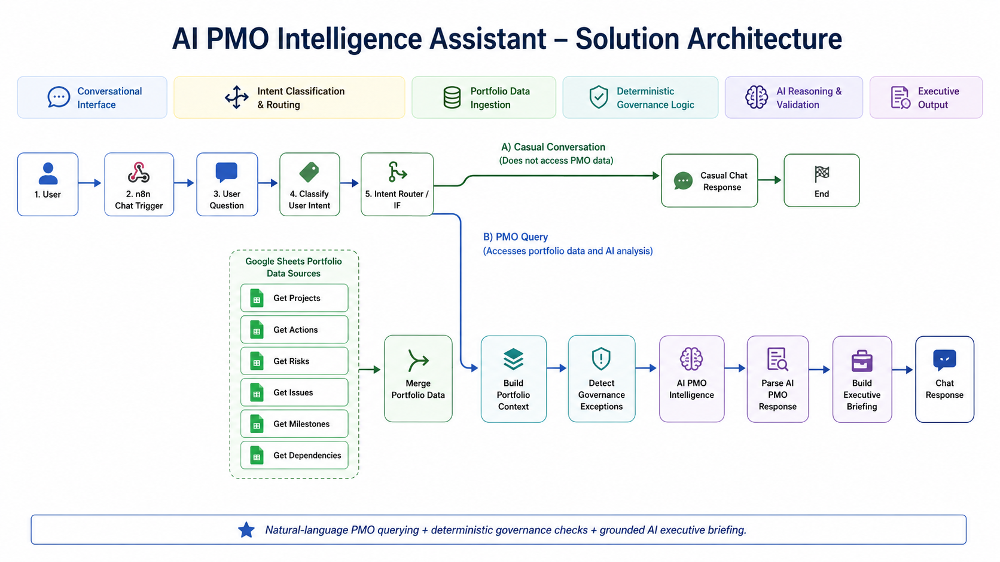
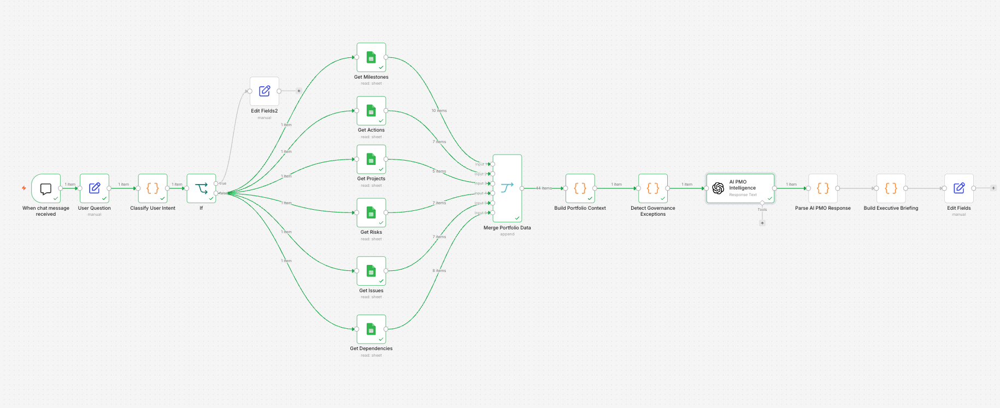
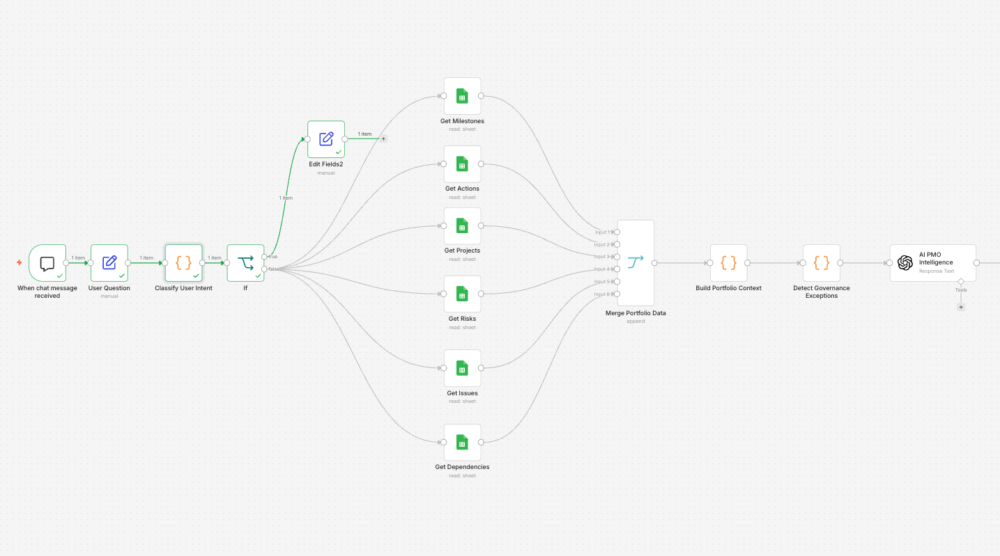
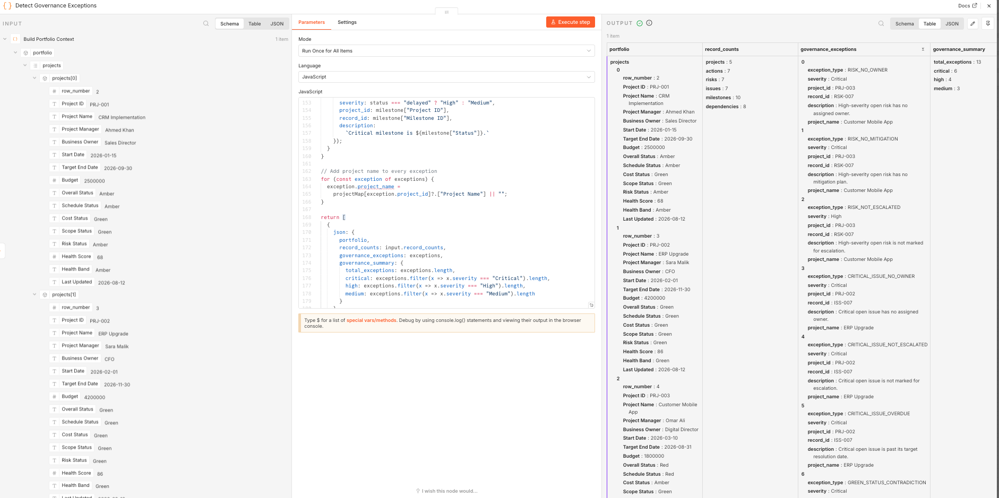
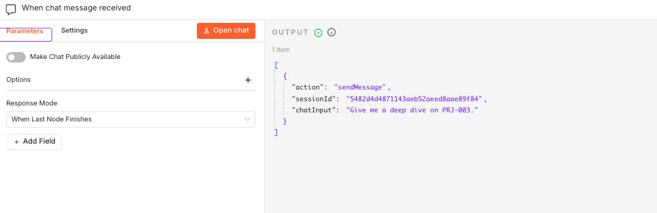

# Project 04 – AI PMO Intelligence Assistant

## 1. Overview

The AI PMO Intelligence Assistant is an interactive AI-powered Project Management Office (PMO) workflow built using n8n, OpenAI, JavaScript, Google Sheets, and Docker.

The assistant allows a user to ask natural-language questions about a project portfolio and receive structured PMO intelligence covering:

- Project health
- Actions
- Risks
- Issues
- Milestones
- Dependencies
- Governance exceptions
- Executive management actions

Unlike a fixed reporting workflow, the assistant first interprets the user's question, determines the required PMO response type, retrieves the relevant portfolio data, applies deterministic governance checks, and then uses AI to generate a grounded executive briefing.

The workflow also distinguishes casual conversation from PMO queries so simple messages such as `hello` bypass unnecessary portfolio data retrieval and AI analysis.

---

## 2. Business Problem

PMO and project leadership teams often manage information across multiple project registers and reporting sources.

Typical portfolio information may be distributed across:

- Project status records
- Action trackers
- Risk registers
- Issue logs
- Milestone trackers
- Dependency registers

This creates several challenges:

- Executives must review multiple reports to understand portfolio health.
- Important governance exceptions may remain hidden inside individual registers.
- Project managers spend time manually consolidating information.
- Portfolio questions often require cross-referencing multiple data sources.
- High-risk records may exist without ownership, mitigation, or escalation.
- Reporting outputs may vary depending on the person preparing the report.
- Static dashboards may show data but do not directly answer management questions.

The objective of this project was to demonstrate how AI and workflow automation can provide a conversational PMO intelligence layer on top of structured portfolio data.

---

## 3. Solution

The solution provides an interactive chat-based PMO assistant.

A user can ask questions such as:

```text
Give me a deep dive on PRJ-003.
```

```text
What are the risks for PRJ-005?
```

```text
What are the top governance exceptions?
```

```text
Give me an executive portfolio summary.
```

The workflow automatically:

1. Receives the natural-language question.
2. Classifies the user intent.
3. Separates casual conversation from PMO analysis.
4. Retrieves portfolio data from six structured Google Sheets sources.
5. Consolidates the portfolio data into a single context object.
6. Applies deterministic PMO governance rules.
7. Sends the structured context to the AI reasoning layer.
8. Generates a query-specific PMO response.
9. Validates the AI response structure and project scope.
10. Builds a formatted executive briefing.
11. Returns the response through the interactive chat interface.

---

## 4. Solution Architecture



The architecture separates deterministic workflow logic from AI reasoning.

```text
User
  ↓
n8n Chat Trigger
  ↓
User Question
  ↓
Classify User Intent
  ↓
Intent Router
  ├── Casual Conversation
  │      ↓
  │   Casual Chat Response
  │
  └── PMO Query
         ↓
      Portfolio Data Sources
         ↓
      Merge Portfolio Data
         ↓
      Build Portfolio Context
         ↓
      Detect Governance Exceptions
         ↓
      AI PMO Intelligence
         ↓
      Parse & Validate AI Response
         ↓
      Build Executive Briefing
         ↓
      Chat Response
```

---

## 5. Workflow Diagram



The PMO branch retrieves data from six Google Sheets sources:

1. Projects
2. Actions
3. Risks
4. Issues
5. Milestones
6. Dependencies

These records are merged before the PMO context is constructed.

---

## 6. Portfolio Data Model

The prototype uses structured sample portfolio data stored in Google Sheets.

### Projects

Contains high-level project health information including:

- Project ID
- Project Name
- Project Manager
- Business Owner
- Start Date
- Target End Date
- Budget
- Overall Status
- Schedule Status
- Cost Status
- Scope Status
- Risk Status
- Health Score
- Health Band
- Last Updated

### Actions

Contains:

- Action ID
- Project ID
- Action
- Owner
- Due Date
- Priority
- Status
- Escalation Required

### Risks

Contains:

- Risk ID
- Project ID
- Risk
- Probability
- Impact
- Risk Score
- Owner
- Mitigation
- Status
- Escalation Required

### Issues

Contains:

- Issue ID
- Project ID
- Issue
- Severity
- Owner
- Target Resolution Date
- Status
- Business Impact
- Escalation Required

### Milestones

Contains:

- Milestone ID
- Project ID
- Milestone
- Planned Date
- Forecast Date
- Actual Date
- Status
- Critical Milestone
- Owner

### Dependencies

Contains:

- Dependency ID
- Project ID
- Dependency
- Dependency Type
- Dependent On
- Owner
- Required By Date
- Status
- Impact if Delayed
- Escalation Required

---

## 7. Natural-Language Intent Classification

The workflow contains a JavaScript intent-classification layer before portfolio data retrieval.

Supported intent categories include:

- `CASUAL_CONVERSATION`
- `PORTFOLIO_SUMMARY`
- `PROJECT_DEEP_DIVE`
- `PORTFOLIO_RISK_QUERY`
- `PROJECT_RISK_QUERY`
- `PORTFOLIO_ISSUE_QUERY`
- `PROJECT_ISSUE_QUERY`
- `PORTFOLIO_ACTION_QUERY`
- `PROJECT_ACTION_QUERY`
- `PORTFOLIO_MILESTONE_QUERY`
- `PROJECT_MILESTONE_QUERY`
- `PORTFOLIO_GOVERNANCE_QUERY`
- `PROJECT_GOVERNANCE_QUERY`
- `GENERAL_PMO_QUERY`

The classifier also detects project identifiers such as:

```text
PRJ-003
```

This allows the workflow to distinguish between portfolio-wide and project-specific questions.

---

## 8. Early Intent Routing



One of the workflow optimizations is that intent classification happens before portfolio data retrieval.

For example:

```text
hello
```

is classified as:

```text
CASUAL_CONVERSATION
```

and is routed directly to the casual response branch.

The six Google Sheets retrieval nodes and PMO AI analysis are therefore not executed for the tested casual-message path.

For PMO questions, the workflow continues through the full portfolio intelligence pipeline.

This architecture separates conversational interaction from PMO intelligence processing.

---

## 9. Multi-Source Portfolio Ingestion

The workflow retrieves structured PMO data from six independent Google Sheets branches.

The prototype dataset used during testing contained:

```text
Projects:      5
Actions:       7
Risks:         7
Issues:        7
Milestones:   10
Dependencies:  8
----------------
Total:        44 records
```

The records are combined using an n8n Merge node in Append mode.

The merged data is then converted into a structured portfolio object before governance analysis begins.

---

## 10. Portfolio Context Construction

The `Build Portfolio Context` JavaScript node classifies the merged records into:

```json
{
  "projects": [],
  "actions": [],
  "risks": [],
  "issues": [],
  "milestones": [],
  "dependencies": []
}
```

The same context object also preserves:

- Original user question
- Detected intent
- Target project ID
- Record counts

This creates a consistent input structure for deterministic governance checks and AI reasoning.

---

## 11. Deterministic Governance Exception Detection

Before the data reaches the AI model, the workflow applies deterministic PMO governance rules.

This is important because governance exceptions should not depend solely on generative AI interpretation.

Example rules include:

### Risk Governance

Identify an open risk when:

- Probability = High
- Impact = High
- Risk Score >= 9
- Owner is missing

Also identify when:

- Mitigation is missing
- Escalation is not enabled

### Issue Governance

Identify a Critical open issue when:

- Owner is missing
- Escalation is not enabled
- Target resolution date is overdue

### Project Governance

Detect contradictions such as:

```text
Project Overall Status = Green
```

while:

```text
Critical Open Issue exists
```

### Milestone Governance

Identify critical milestones when:

- Status = Delayed
- Status = At Risk

Each detected exception is assigned a deterministic governance severity.

---

## 12. Tested Governance Exceptions



The prototype generated 13 governance exceptions across the sample portfolio:

```text
Critical: 6
High:     4
Medium:   3
Total:   13
```

Examples included:

### RSK-007

The record was:

```text
Probability: High
Impact: High
Risk Score: 9
Status: Open
Owner: Missing
Mitigation: Missing
Escalation Required: No
```

Detected exceptions included:

- No assigned owner
- No mitigation plan
- Not marked for escalation

### ISS-007

The workflow detected:

- Critical issue with no owner
- Critical issue not escalated
- Critical issue overdue

The workflow also detected a Green-project / Critical-issue contradiction and several delayed or at-risk critical milestones.

---

## 13. Deterministic Logic + AI Reasoning

The architecture deliberately separates:

```text
Deterministic Governance Logic
```

from:

```text
AI Interpretation and Executive Reasoning
```

The JavaScript governance layer determines objective rule violations.

The AI layer then uses:

- Portfolio data
- Query context
- Governance exceptions
- Record counts

to generate management-oriented insights and recommendations.

This prevents the AI model from being solely responsible for identifying governance failures.

---

## 14. Grounded AI PMO Intelligence

The AI reasoning layer is instructed to use only the structured portfolio data and deterministic governance findings supplied by the workflow.

Grounding rules include:

- Do not invent project facts.
- Do not invent owners.
- Do not invent deadlines.
- Do not invent business impacts.
- Do not invent communication recipients.
- Preserve exact source classifications.
- Keep recommendations separate from factual findings.
- Keep project-specific responses scoped to the requested project.
- Do not reinterpret governance severity as Risk severity.

For example, a Risk record with:

```text
Probability: High
Impact: High
Risk Score: 9
```

must remain described using those source classifications.

If a deterministic governance exception is Critical, that severity applies to the governance exception and must not be presented as the Risk's own severity.

---

## 15. Query-Aware AI Responses

The AI response changes depending on the detected intent.

### Project Deep Dive

Example:

```text
Give me a deep dive on PRJ-003.
```

The assistant can return:

- Project health
- Actions
- Risks
- Issues
- Milestones
- Dependencies
- Top concerns
- Governance findings
- Recommended management actions
- Executive-attention indicator

### Project Risk Query

Example:

```text
What are the risks for PRJ-005?
```

The response focuses on the requested project's Risk information and relevant management context.

### Governance Query

Example:

```text
What are the top governance exceptions?
```

The response focuses on deterministic governance exceptions across the portfolio.

### Portfolio Summary

Example:

```text
Give me an executive portfolio summary.
```

The response provides portfolio-level management information rather than a single-project deep dive.

---

## 16. AI Response Validation

The workflow does not send raw AI output directly to the user.

A dedicated parsing and validation layer checks the AI response before briefing generation.

Validation includes:

- JSON structure
- Required top-level fields
- Expected arrays
- Project-specific intent
- Target Project ID
- Project Deep Dive Project ID
- Project IDs contained in Top Concerns
- Project IDs contained in Governance Findings
- Project IDs contained in Recommended Management Actions
- Projects Requiring Attention scope

For project-specific queries, unrelated project records are rejected.

This adds a governance control between generative AI reasoning and the final user-facing response.

---

## 17. Defensive Output Formatting

During testing, the AI occasionally returned nested JSON fields using different naming styles.

For example:

```text
Action ID
```

and:

```text
action_id
```

The final briefing formatter was therefore designed to support both field formats.

The same defensive mapping is applied across:

- Actions
- Risks
- Issues
- Milestones
- Dependencies

This prevents the user-facing briefing from failing simply because the model changes JSON field capitalization or naming style.

---

## 18. Executive Briefing Generation

The final JavaScript formatter creates a clean Markdown briefing.

Project-specific responses can contain:

```text
AI PMO Intelligence — Project Briefing

Executive Summary
Project Health
Actions
Risks
Issues
Milestones
Dependencies
Top Concerns
Governance Findings
Recommended Management Actions
Executive Attention
```

Portfolio queries generate:

```text
AI PMO Intelligence — Portfolio Briefing
```

with portfolio-level content.

Priority values such as:

```text
P1
P2
P3
1
2
3
```

are normalized for display into:

```text
Critical
High
Medium
```

without changing the underlying source data.

---

## 19. Example Project Deep Dive

Example query:

```text
Give me a deep dive on PRJ-003.
```

The workflow identified:

```text
Intent: PROJECT_DEEP_DIVE
Target Project: PRJ-003
```

PRJ-003 was reported as:

```text
Project: Customer Mobile App
Overall Status: Red
Health Score: 42
Health Band: Red
Schedule Status: Red
Cost Status: Amber
Scope Status: Green
Risk Status: Red
```

The response included:

```text
2 Actions
2 Risks
2 Issues
2 Milestones
2 Dependencies
```

The assistant also surfaced governance findings associated with RSK-007, including missing ownership and mitigation.

---

## 20. Interactive Chat Interface



The workflow uses the n8n Chat Trigger as the user-facing entry point.

The user can submit a natural-language PMO question and receive the final executive briefing directly through the chat interface.

This was tested end-to-end using:

```text
Give me a deep dive on PRJ-003.
```

The request successfully passed through:

```text
Chat Trigger
→ Intent Classification
→ Portfolio Retrieval
→ Portfolio Consolidation
→ Governance Detection
→ AI Reasoning
→ AI Response Validation
→ Executive Briefing
→ Chat Response
```

---

## 21. Technology Stack

- n8n
- OpenAI
- JavaScript
- Google Sheets
- Docker
- Google Workspace
- GitHub
- Markdown

---

## 22. Key Design Principles

### Deterministic Before Generative

Objective PMO controls are evaluated using deterministic JavaScript rules before AI reasoning.

### Grounded AI

The model receives structured portfolio data and is instructed not to invent unsupported information.

### Scope Control

Project-specific requests are validated so unrelated project information does not appear in the response.

### Human-Readable Output

Structured AI JSON is converted into an executive-friendly Markdown briefing.

### Defensive Workflow Design

The formatter supports multiple nested-field naming conventions to reduce model-output brittleness.

### Efficient Routing

Casual messages bypass the full PMO data and AI pipeline.

---

## 23. Business Value

The prototype demonstrates how an AI-enabled PMO intelligence layer could help users:

- Query structured portfolio data using natural language
- Consolidate information across multiple PMO registers
- Surface governance exceptions
- Identify project records requiring attention
- Generate structured executive briefings
- Separate deterministic controls from AI recommendations
- Improve accessibility of portfolio information

This project demonstrates technical capability and workflow design rather than measured enterprise productivity improvement.

---

## 24. Tested Scenarios

### Casual Conversation

```text
hello
```

Result:

```text
CASUAL_CONVERSATION
```

The PMO portfolio branch was bypassed.

### Portfolio Summary

```text
Give me an executive portfolio summary.
```

Result:

```text
PORTFOLIO_SUMMARY
```

### Project Deep Dive

```text
Give me a deep dive on PRJ-003.
```

Result:

```text
PROJECT_DEEP_DIVE
Target: PRJ-003
```

### Project Risk Query

```text
What are the risks for PRJ-005?
```

Result:

```text
PROJECT_RISK_QUERY
Target: PRJ-005
```

### Governance Query

```text
What are the top governance exceptions?
```

Result:

```text
PORTFOLIO_GOVERNANCE_QUERY
```

---

## 25. Key Learning Outcomes

This project demonstrated how to:

1. Build a conversational AI workflow in n8n.
2. Convert natural-language questions into structured PMO intents.
3. Route casual and analytical requests differently.
4. Consolidate multiple structured data sources.
5. Create a unified portfolio context.
6. Implement deterministic PMO governance rules.
7. Combine rule-based governance with generative AI.
8. Design grounded AI prompts for management reporting.
9. Validate AI-generated JSON before use.
10. Enforce project-level scope integrity.
11. Generate intent-aware executive briefings.
12. Build defensive formatting logic around non-deterministic AI output.
13. Return the final response through an interactive chat interface.

---

## 26. Limitations

The current version is a portfolio prototype using structured sample data.

It does not claim:

- Enterprise production deployment
- Autonomous PMO decision-making
- Microsoft Copilot integration
- Real-time integration with enterprise project-management platforms
- Measured productivity or financial savings
- Unrestricted natural-language understanding
- Replacement of project or portfolio managers

The assistant should be treated as a decision-support and portfolio intelligence prototype.

---

## 27. Future Enhancements

Potential future improvements include:

- Jira integration
- Microsoft Project integration
- SharePoint integration
- Enterprise RAID register integration
- Role-based access controls
- User authentication
- Conversation memory
- Additional intent types
- Automated portfolio trend analysis
- Historical project health comparison
- PMO policy and SOP retrieval
- Power BI integration
- Automated executive reporting
- Human approval for selected management actions
- Production-grade logging and monitoring

---

## 28. Evidence

The implementation was progressively tested and documented during development.

Evidence includes:

- Multi-source portfolio ingestion
- Portfolio context consolidation
- Deterministic governance exception detection
- Grounded AI executive reasoning
- AI response parsing and validation
- Executive briefing generation
- Natural-language intent detection
- Query-aware project deep dives
- Project-level scope validation
- Multi-intent query handling
- Portfolio governance queries
- Interactive chat execution
- Pre-ingestion intent routing and casual-message bypass

Only capabilities that were built and tested in the prototype are claimed.

---

## 29. Repository Structure

```text
Project-04-AI-PMO-Intelligence-Assistant/
│
├── README.md
│
├── workflow/
│   └── AI-PMO-Intelligence-Assistant.json
│
├── images/
│   ├── architecture.png
│   ├── workflow.png
│   ├── intent-routing.png
│   ├── governance-exceptions.png
│   └── chat-project-deep-dive.png
│
├── evidence/
│   └── evidence-register.md
│
└── sample-data/
    └── portfolio-data.md
```

---

## 30. Project Status

**Status: Completed Prototype**

The current version demonstrates an end-to-end conversational AI PMO intelligence workflow combining:

```text
Natural-Language Querying
+
Structured Portfolio Data
+
Deterministic Governance
+
Grounded AI Reasoning
+
Response Validation
+
Executive Briefing
```

The project is designed as a portfolio demonstration of practical AI automation applied to Project Management Office governance and portfolio intelligence.
