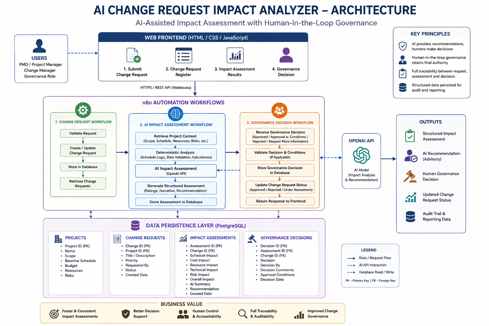
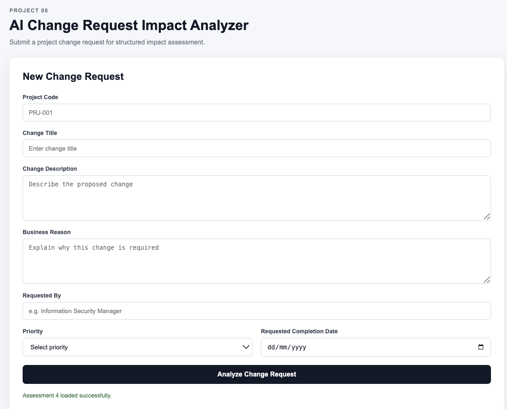
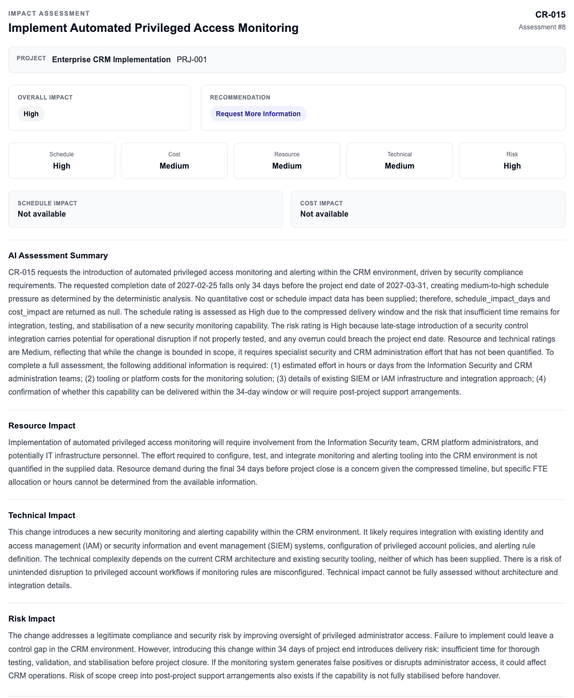
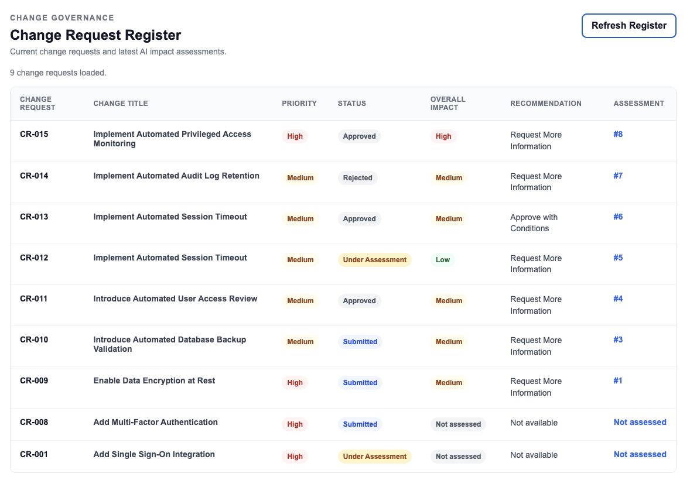
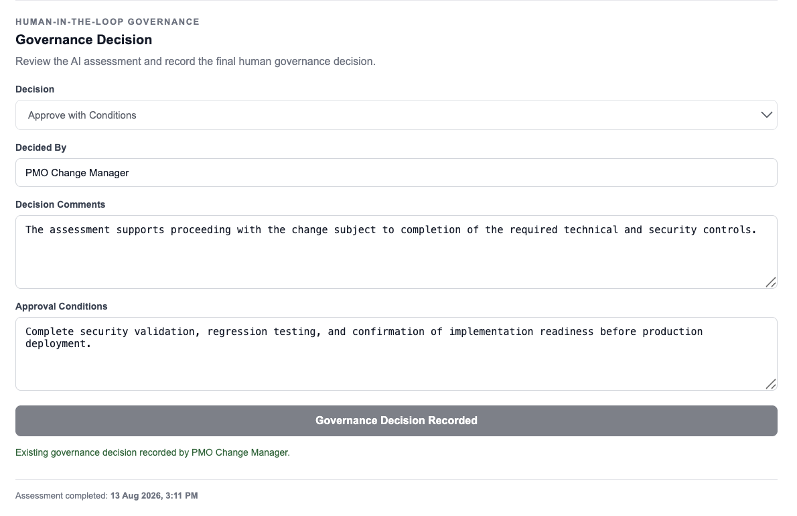

# Project 06 – AI Change Request Impact Analyzer

An AI-assisted project change governance application that evaluates proposed project changes across schedule, cost, resources, technical complexity, and risk while retaining final decision authority with a human governance role.

The solution combines a browser-based frontend, n8n workflow automation, PostgreSQL persistence, deterministic assessment logic, AI-generated qualitative impact analysis, and a human-in-the-loop governance workflow.

---

## 1. Overview

Project changes can affect schedule, cost, resources, technical architecture, delivery risk, operational readiness, and project scope.

In many project environments, change impact assessment is still performed manually using fragmented project information, subjective judgement, spreadsheets, email discussions, and governance meetings.

The **AI Change Request Impact Analyzer** introduces a structured workflow that:

1. accepts a project change request,
2. retrieves the related project context,
3. performs deterministic analysis,
4. generates an AI-assisted qualitative impact assessment,
5. stores the structured assessment,
6. presents the assessment through a browser-based interface,
7. records the final human governance decision,
8. updates the change-request lifecycle status, and
9. maintains a centralized change-request register.

The application intentionally separates **AI recommendation** from **human governance authority**.

AI provides decision support.  
The final approval decision remains with the human governance role.

---

## 2. Business Problem

Project change requests often require analysis across several dimensions before an approval decision can be made.

Typical considerations include:

- Schedule impact
- Cost impact
- Resource impact
- Technical complexity
- Delivery risk
- Business justification
- Requested completion date
- Project lifecycle stage
- Operational impact

Traditional change-control processes can become slow and inconsistent when project managers must manually collect information from multiple systems and prepare assessments for governance review.

Common problems include:

- inconsistent impact assessments,
- incomplete information,
- subjective scoring,
- delayed governance decisions,
- limited traceability between assessment and approval,
- weak audit history,
- duplicated manual effort,
- and difficulty maintaining an up-to-date change register.

---

## 3. Solution

The solution provides an end-to-end change-governance workflow:

```text
Change Request
      ↓
Project Context Retrieval
      ↓
Deterministic Analysis
      ↓
AI Impact Assessment
      ↓
Structured Validation
      ↓
Assessment Persistence
      ↓
Human Governance Review
      ↓
Final Governance Decision
      ↓
Change Status Update
      ↓
Change Request Register
```

The solution uses deterministic logic for facts and calculations that can be derived from supplied project data and AI for qualitative reasoning where contextual interpretation is useful.

Quantitative values are not invented when the required input data is unavailable.

---

## 4. Solution Architecture



The solution contains four primary architectural layers.

### Presentation Layer

A browser-based frontend built with HTML, CSS, and JavaScript provides:

- Change Request Submission
- Change Request Register
- Impact Assessment Results
- Historical Assessment Retrieval
- Human Governance Decision Interface

### Automation / API Layer

n8n acts as the workflow orchestration and API layer.

It manages:

- webhook endpoints,
- validation,
- PostgreSQL queries,
- project-context retrieval,
- deterministic calculations,
- AI orchestration,
- structured output validation,
- governance decisions,
- and API responses.

### Intelligence Layer

The assessment combines:

- deterministic project/change calculations,
- structured AI impact analysis,
- multidimensional ratings,
- AI-generated narrative assessment,
- and governance recommendations.

### Data Layer

PostgreSQL provides persistent storage for:

- projects,
- change requests,
- impact assessments,
- and governance decisions.

---

## 5. High-Level Architecture Flow

```text
┌──────────────────────┐
│      PMO / User      │
└──────────┬───────────┘
           │
           ▼
┌───────────────────────────────┐
│       Web Frontend            │
│ HTML + CSS + JavaScript       │
│                               │
│ • Submit Change Request       │
│ • View Change Register        │
│ • View Assessment             │
│ • Record Human Decision       │
└──────────────┬────────────────┘
               │ HTTP / JSON
               ▼
┌───────────────────────────────────────────┐
│                   n8n                     │
│          Automation / API Layer           │
│                                           │
│  Change Request Processing                │
│        ↓                                  │
│  Project Context Retrieval                │
│        ↓                                  │
│  Deterministic Impact Analysis            │
│        ↓                                  │
│  AI Impact Assessment                     │
│        ↓                                  │
│  Structured Validation                    │
│        ↓                                  │
│  Assessment Persistence                   │
│        ↓                                  │
│  Human Governance Workflow                │
│        ↓                                  │
│  Change Status Update                     │
└──────────────┬──────────────────┬─────────┘
               │                  │
               ▼                  ▼
       ┌───────────────┐   ┌───────────────┐
       │  PostgreSQL   │   │   OpenAI API  │
       │               │   │               │
       │ Projects      │   │ Qualitative   │
       │ Changes       │   │ impact        │
       │ Assessments   │   │ assessment    │
       │ Decisions     │   │               │
       └───────────────┘   └───────────────┘
```

---

## 6. Change Request Lifecycle

A change request moves through a controlled governance lifecycle.

Example lifecycle:

```text
Submitted
    ↓
Under Assessment
    ↓
Human Governance Review
    ↓
Approved / Rejected
```

A **Request More Information** decision returns the request to an assessment state.

The implemented governance-to-status mapping is:

| Governance Decision | Change Request Status |
|---|---|
| Approved | Approved |
| Approved with Conditions | Approved |
| Rejected | Rejected |
| Request More Information | Under Assessment |

The AI recommendation and the final human decision are stored separately.

---

## 7. Key Capabilities

The current implementation includes:

- Structured change-request submission
- Project-context retrieval
- Centralized change-request register
- Deterministic schedule-pressure calculation
- AI-assisted impact assessment
- Structured JSON output validation
- Schedule impact rating
- Cost impact rating
- Resource impact rating
- Technical impact rating
- Risk impact rating
- Overall impact classification
- AI-generated assessment summary
- AI recommendation
- PostgreSQL assessment persistence
- Historical assessment retrieval
- Human-in-the-loop governance
- Governance decision persistence
- Governance decision comments
- Conditional approval requirements
- Change-request status synchronization
- Existing governance-decision retrieval
- Duplicate governance decision protection in the frontend
- Dynamic register refresh
- REST/webhook integration between frontend and n8n

---

## 8. Change Request Submission



The frontend provides a structured form for submitting a new change request.

Example input fields include:

- Project Code
- Change Title
- Change Description
- Business Reason
- Requested By
- Priority
- Requested Completion Date

The frontend sends the request to the n8n production webhook as JSON.

Example request:

```json
{
  "project_code": "PRJ-001",
  "change_title": "Implement Automated Session Timeout",
  "change_description": "Introduce configurable automatic session timeout controls for inactive CRM users.",
  "business_reason": "Reduce the security risk associated with unattended authenticated CRM sessions and strengthen access control compliance.",
  "requested_by": "Information Security Manager",
  "priority": "Medium",
  "requested_completion_date": "2027-02-15"
}
```

---

## 9. Project Context Retrieval

The workflow retrieves the project record associated with the supplied project code.

Example project context used during testing:

```text
Project Code: PRJ-001
Project Name: Enterprise CRM Implementation
Project Status: Active
Project Budget: AED 5,000,000
Project Planned End Date: 31 March 2027
```

This context is combined with the submitted change request before impact analysis begins.

---

## 10. Deterministic Impact Analysis

The workflow performs deterministic calculations before invoking AI.

This ensures factual project data is separated from AI interpretation.

Example deterministic outputs include:

- Priority weight
- Days before project end
- Schedule pressure
- Deterministic analysis status

Example:

```json
{
  "priority_weight": 2,
  "days_before_project_end": 44,
  "schedule_pressure": "Medium",
  "deterministic_analysis_status": "COMPLETED"
}
```

Deterministic values are used as factual context for the AI assessment.

---

## 11. AI Impact Assessment



The AI assessment evaluates the proposed change across multiple dimensions.

### Assessment Dimensions

| Dimension | Description |
|---|---|
| Schedule | Delivery-window and timing impact |
| Cost | Known or expected financial impact |
| Resource | Team, specialist, and capacity requirements |
| Technical | Implementation and integration complexity |
| Risk | Delivery, operational, security, and project risk |
| Overall Impact | Consolidated qualitative impact |

Example structured output:

```json
{
  "schedule_impact_days": null,
  "cost_impact": null,
  "schedule_rating": "Medium",
  "cost_rating": "Low",
  "resource_rating": "Medium",
  "technical_rating": "Low",
  "risk_rating": "Medium",
  "overall_impact": "Medium",
  "recommendation": "Approve with Conditions"
}
```

---

## 12. No Unsupported Quantitative Estimation

A deliberate design decision in Project 06 is to avoid inventing quantitative schedule or cost impacts.

If the source data does not include sufficient information such as:

- effort estimates,
- labour rates,
- vendor quotations,
- licensing costs,
- task-level schedules,
- resource availability,
- or infrastructure costs,

the workflow retains values such as:

```text
schedule_impact_days = null
cost_impact = null
```

The AI can still provide a qualitative impact rating and explain what additional information is required.

This preserves the distinction between:

- known data,
- qualitative judgement,
- and unavailable quantitative evidence.

---

## 13. AI Assessment Validation

The AI response is validated before persistence.

The validation layer checks that the structured output conforms to the expected assessment model.

Example rating values:

```text
Low
Medium
High
Critical
```

The workflow also validates that the response includes the required qualitative assessment fields.

This prevents malformed AI output from being written directly into the database.

---

## 14. Change Request Register



The application includes a live Change Request Register retrieved from PostgreSQL through a dedicated n8n GET API.

The register displays:

- Change Request Code
- Change Title
- Priority
- Current Status
- Overall Impact
- AI Recommendation
- Assessment Reference

The register retrieves only the latest impact assessment associated with each change request.

Unassessed change requests remain visible and display:

```text
Not assessed
```

instead of being removed from the register.

---

## 15. Historical Assessment Retrieval

Assessment references in the register are interactive.

Selecting an assessment such as:

```text
#6
```

retrieves the complete saved assessment from PostgreSQL using the assessment API.

The application then populates the existing Impact Assessment dashboard with the historical assessment.

This allows the same result interface to support:

- newly generated assessments,
- and previously saved assessments.

---

## 16. Human-in-the-Loop Governance



Project 06 intentionally keeps AI recommendations advisory.

The final governance decision is recorded by a human decision-maker.

Supported decisions are:

- Approved
- Approved with Conditions
- Rejected
- Request More Information

The governance record captures:

- Change Request ID
- Assessment ID
- Governance Decision
- Decision Comments
- Approval Conditions
- Decided By
- Decision Timestamp

Example:

```text
Decision:
Approved with Conditions

Decided By:
PMO Change Manager

Decision Comments:
The assessment supports proceeding with the change subject to completion of the required technical and security controls.

Approval Conditions:
Complete security validation, regression testing, and confirmation of implementation readiness before production deployment.
```

---

## 17. AI Recommendation vs Human Decision

The application intentionally preserves both the AI recommendation and the human decision.

For example:

```text
AI Recommendation:
Request More Information

Human Governance Decision:
Approved with Conditions
```

This is valid behavior.

The AI provides assessment and decision support.

The authorized human governance role retains final decision authority.

The human decision does not overwrite or delete the original AI recommendation.

This provides better governance traceability and supports later review of AI-versus-human decision outcomes.

---

## 18. Governance Decision Locking

When an assessment already has a recorded governance decision, the frontend retrieves the saved decision and presents it in a locked state.

The application:

- populates the saved decision,
- populates the decision maker,
- restores decision comments,
- restores approval conditions,
- disables governance fields,
- disables resubmission,
- and changes the button to:

```text
Governance Decision Recorded
```

Assessments without an existing decision remain editable.

This prevents accidental duplicate decision submission from the frontend.

---

## 19. Governance Decision Validation

The governance workflow validates incoming human-decision requests before database persistence.

Validation checks include:

- valid positive change-request ID,
- valid assessment ID or null,
- supported governance decision,
- required decision-maker,
- and required approval conditions when using `Approved with Conditions`.

Allowed decision values:

```text
Approved
Approved with Conditions
Rejected
Request More Information
```

---

## 20. Database Architecture

PostgreSQL provides the persistence layer.

Core entities include:

### Projects

Stores project context used during impact assessment.

### Change Requests

Stores submitted project change requests and their current lifecycle status.

### Change Impact Assessments

Stores structured AI-assisted impact assessments.

Key fields include:

- assessment_id
- change_request_id
- schedule_impact_days
- cost_impact
- resource_impact
- technical_impact
- risk_impact
- schedule_rating
- cost_rating
- resource_rating
- technical_rating
- risk_rating
- overall_impact
- ai_summary
- recommendation
- assessed_by
- assessed_at

### Change Governance Decisions

Stores the final human governance record.

Key fields include:

- decision_id
- change_request_id
- assessment_id
- decision
- decision_comments
- conditions
- decided_by
- decided_at

Foreign-key relationships maintain traceability across the change lifecycle.

---

## 21. Frontend Application

The frontend is implemented using:

```text
HTML
CSS
JavaScript
```

It provides three primary application views within the same interface:

### New Change Request

Used to submit proposed project changes.

### Impact Assessment Result

Displays structured impact ratings, narrative analysis, AI recommendation, and assessment metadata.

### Change Request Register

Provides consolidated visibility of all change requests and linked assessments.

The Human-in-the-Loop Governance section is displayed within the assessment result interface.

---

## 22. n8n Automation Workflows

n8n acts as the workflow orchestration and backend API layer.

The implemented solution includes workflows for:

### Change Request Processing

Handles:

- incoming webhook requests,
- input validation,
- project retrieval,
- change-request persistence,
- deterministic analysis,
- AI impact assessment,
- structured validation,
- assessment persistence,
- and frontend API response.

### Change Request Register API

Handles:

- GET register request,
- PostgreSQL change retrieval,
- latest-assessment selection,
- and JSON API response.

### Assessment Retrieval API

Handles:

- assessment ID query,
- PostgreSQL assessment retrieval,
- project/change context,
- latest governance decision retrieval,
- and JSON response.

### Governance Decision Processing

Handles:

- human decision submission,
- governance validation,
- PostgreSQL decision persistence,
- change-request status update,
- and frontend response.

---

## 23. API / Webhook Endpoints

The local development implementation exposes n8n webhook endpoints.

### Submit Change Request

```text
POST /webhook/change-request
```

Purpose:

Submit a change request and execute the impact-assessment workflow.

### Get Change Request Register

```text
GET /webhook/change-requests
```

Purpose:

Retrieve the centralized change register with latest assessment data.

### Get Saved Assessment

```text
GET /webhook/change-assessment?assessment_id={id}
```

Purpose:

Retrieve a historical impact assessment and associated governance decision.

### Record Governance Decision

```text
POST /webhook/change-decision
```

Purpose:

Persist the final human governance decision and update the associated change-request lifecycle status.

> These endpoints are part of a local portfolio/development implementation and are not presented as production-hardened public APIs.

---

## 24. Tested Governance Scenarios

All four configured human governance decision paths were functionally tested.

| Governance Decision | Expected Status | Result |
|---|---|---|
| Approved | Approved | Passed |
| Approved with Conditions | Approved | Passed |
| Rejected | Rejected | Passed |
| Request More Information | Under Assessment | Passed |

**Result: 4/4 configured governance decision paths tested successfully.**

---

## 25. Additional Functional Testing

The project was also tested for:

- Change request creation
- Project-context retrieval
- Deterministic schedule analysis
- Structured AI assessment
- AI output validation
- Assessment persistence
- Change register retrieval
- Latest assessment selection
- Unassessed change visibility
- Historical assessment retrieval
- Governance-decision persistence
- Change-request status synchronization
- Existing governance-decision retrieval
- Read-only governance state
- Switching between decided and undecided assessments
- Register refresh after governance decisions
- Handling unavailable schedule/cost quantitative data

---

## 26. Technology Stack

| Technology | Purpose |
|---|---|
| n8n | Workflow orchestration and webhook/API layer |
| OpenAI API | AI-assisted qualitative impact assessment |
| PostgreSQL | Persistent project, change, assessment, and governance data |
| JavaScript | Frontend application logic and workflow code |
| HTML | Frontend structure |
| CSS | Frontend presentation |
| REST / HTTP Webhooks | Frontend-to-n8n communication |
| Docker | Local service environment |
| GitHub | Source control and portfolio documentation |

---

## 27. Repository Structure

```text
06-AI Change Request Impact Analyzer/
│
├── README.md
│
├── frontend/
│   ├── index.html
│   ├── app.js
│   └── styles.css
│
├── workflows/
│   ├── change-request-processing.json
│   ├── change-request-register.json
│   ├── assessment-retrieval.json
│   └── governance-decision.json
│
├── database/
│   ├── schema.sql
│   └── sample-data.sql
│
├── docs/
│   ├── architecture.md
│   ├── assessment-logic.md
│   ├── governance-workflow.md
│   └── testing.md
│
├── images/
│   ├── architecture.png
│   ├── frontend-change-request.png
│   ├── change-request-register.png
│   ├── ai-impact-assessment.png
│   ├── hitl-governance.png
│   └── governance-register.png
│
└── evidence/
    └── README.md
```

---

## 28. Recommended Portfolio Images

### Solution Architecture

```text
images/architecture.png
```

Shows the complete relationship between:

- frontend,
- n8n,
- deterministic analysis,
- AI assessment,
- PostgreSQL,
- and HITL governance.

### Change Request Interface

```text
images/frontend-change-request.png
```

Shows the browser-based request-submission interface.

### Change Request Register

```text
images/change-request-register.png
```

Shows priority, lifecycle status, overall impact, recommendation, and assessment linkage.

### AI Impact Assessment

```text
images/ai-impact-assessment.png
```

Shows the structured assessment result including ratings and narrative analysis.

### Human-in-the-Loop Governance

```text
images/hitl-governance.png
```

Shows an existing human governance decision with decision maker, rationale, conditions, and duplicate-submission locking.

### Governance Register

```text
images/governance-register.png
```

Shows multiple change lifecycle states such as:

- Approved
- Rejected
- Under Assessment
- Submitted

---

## 29. Security and Governance Design Considerations

The solution demonstrates several governance-oriented design principles.

### Human Authority

AI does not make the final approval decision.

### Traceability

Change requests, assessments, and governance decisions remain linked through database relationships.

### AI Recommendation Preservation

Human decisions do not overwrite the original AI recommendation.

### Unknown Data Handling

Unavailable quantitative values are retained as unknown rather than fabricated.

### Decision Validation

Governance decisions are validated before persistence.

### Duplicate Protection

Existing governance decisions are retrieved and locked in the frontend.

---

## 30. Limitations

The current project is a portfolio/development implementation.

It has **not** been validated as:

- an enterprise production deployment,
- a public cloud production application,
- a high-availability platform,
- a cybersecurity-certified system,
- a compliance-certified change-management platform,
- or an organization-wide governance solution.

The project does not claim measured:

- cost savings,
- productivity improvements,
- decision-quality improvements,
- schedule reductions,
- or operational performance improvements

unless supported by measured evidence.

The current frontend also uses local development endpoints and does not implement production-grade authentication or authorization.

---

## 31. Future Enhancements

Potential future extensions include:

- Authentication
- Role-based access control
- Change Approval Board workflow
- Multi-level approval routing
- Email or Microsoft Teams notifications
- Supporting-document uploads
- Evidence attachment management
- Project baseline integration
- Schedule-engine integration
- Automated cost estimation
- Resource-capacity integration
- Change-request version history
- Reassessment workflow
- Governance escalation rules
- SLA tracking
- Approval delegation
- Power BI change-governance dashboard
- Audit reporting
- AI-versus-human decision analytics
- Cloud deployment
- API authentication
- Automated integration testing

---

## 32. Skills Demonstrated

Project 06 demonstrates practical capability across:

### AI and Automation

- AI workflow orchestration
- Structured AI output
- Hybrid deterministic + AI analysis
- AI validation
- Human-in-the-loop AI governance

### Project / PMO Governance

- Change control
- Impact assessment
- Governance workflow design
- Decision traceability
- Change lifecycle management
- Risk-based assessment

### Data Engineering

- PostgreSQL data modelling
- Relational joins
- Foreign-key relationships
- Latest-state retrieval
- Structured persistence
- SQL query design

### Application Development

- HTML
- CSS
- JavaScript
- Dynamic UI rendering
- Frontend state management
- REST API consumption
- Form validation
- Read-only state handling

### Integration

- n8n
- PostgreSQL
- OpenAI API
- HTTP webhooks
- JSON
- Docker

### Engineering Practice

- Functional testing
- Debugging
- Validation
- Error handling
- Evidence capture
- Architecture documentation

---

## 33. Project Outcome

Project 06 demonstrates an end-to-end AI-assisted project change-governance application rather than a standalone AI prompt or isolated automation.

The implemented workflow connects:

```text
Project Data
    +
Change Request
    ↓
Deterministic Analysis
    ↓
AI Impact Assessment
    ↓
Structured Persistence
    ↓
Human Governance Decision
    ↓
Controlled Change Status
    ↓
Auditable Change Register
```

The central design principle is:

> **AI supports the governance decision; it does not replace the governance decision-maker.**

---

## 34. Project Status

**Status:** Functional portfolio implementation

Completed and tested capabilities include:

- Change Request Submission
- Deterministic Impact Analysis
- AI Impact Assessment
- Structured Assessment Validation
- PostgreSQL Assessment Persistence
- Change Request Register
- Historical Assessment Retrieval
- Human-in-the-Loop Governance
- Governance Decision Persistence
- Governance Status Updates
- Existing Decision Retrieval
- Duplicate Decision Protection
- Four Governance Decision Paths

---

## 35. Portfolio Disclaimer

This repository demonstrates a locally developed and functionally tested portfolio solution.

Claims in this repository are limited to capabilities that were actually built and tested.

The project does not represent or claim:

- enterprise production deployment,
- organization-wide adoption,
- measured financial savings,
- measured productivity improvement,
- formal security certification,
- or regulatory compliance certification.
