# Project 07 | AI Resource, Capacity & Governance Planning Agent

## Overview

An AI-assisted portfolio resource and capacity planning solution that identifies resource over-allocation, evaluates mitigation scenarios, supports human governance decisions, preserves an audit trail, and provides live and historical reporting through a React frontend.

The solution separates **deterministic capacity calculations** from **AI-assisted explanation and recommendation**. Utilization, over-allocation, conflict severity, scenario scoring, and reporting metrics are calculated using PostgreSQL, SQL, and JavaScript. Human approval remains the final governance authority.

---

## Business Problem

Portfolio teams often manage resource demand across multiple projects using spreadsheets and manual reviews. This makes it difficult to identify:

- Over-allocated resources
- Upcoming capacity shortages
- Conflicting project priorities
- Cross-project resource dependencies
- Governance decisions and approvals
- Historical capacity positions
- Evidence of how mitigation decisions were made

This project creates a structured workflow for detecting, assessing, governing, and reporting resource-capacity issues.

---

## Key Capabilities

- Consolidates project resource demand and weekly resource capacity
- Calculates available capacity and utilization deterministically
- Detects resource over-allocation
- Classifies conflict severity
- Maintains a capacity conflict register
- Generates and ranks mitigation scenarios
- Separates recommendation logic from human approval
- Records governance decisions and audit events
- Supports project/resource planning intake
- Recalculates capacity conflicts after planning updates
- Persists weekly management snapshots
- Stores weekly exception details
- Sends scheduled weekly capacity reports
- Exposes REST-style frontend APIs through n8n Webhooks
- Provides a React/Vite operational portal with six working screens

---

## Solution Architecture

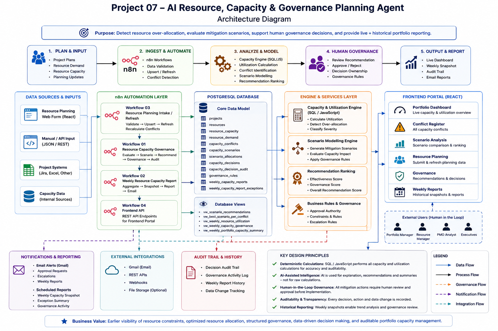

### High-Level Flow

```text
Project / Resource Demand
        ↓
PostgreSQL
        ↓
Capacity & Allocation Engine
        ↓
Conflict Detection
        ↓
Scenario Modelling & Ranking
        ↓
AI-Assisted Recommendation Explanation
        ↓
Human Governance Decision
        ↓
Decision + Audit Register
        ↓
Weekly Snapshot / Reporting
        ↓
React Frontend + Email Reporting
```

---

## Frontend Screens

The operational portal contains six completed screens.

### 1. Portfolio Dashboard

Displays the live portfolio capacity position, total demand, utilization, overloaded resources, critical resources, governance status, and current exceptions.

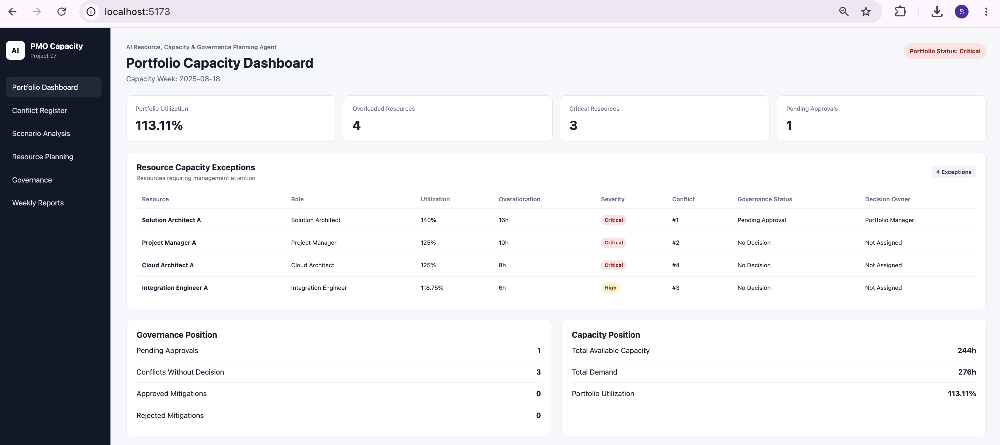

### 2. Conflict Register

Displays active capacity conflicts, utilization, over-allocation, severity, current governance status, and decision state.

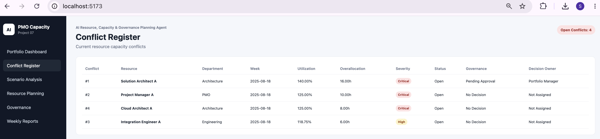

### 3. Scenario Analysis

Displays mitigation scenarios, scenario ranking, baseline vs proposed utilization, effectiveness score, governance score, overall recommendation score, and proposed allocation changes.

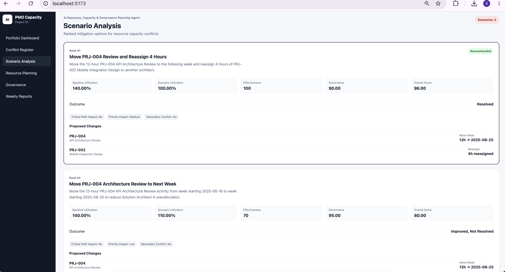

### 4. Resource Planning

Provides a frontend intake form for adding or refreshing project, resource, capacity, and demand information through the n8n API.

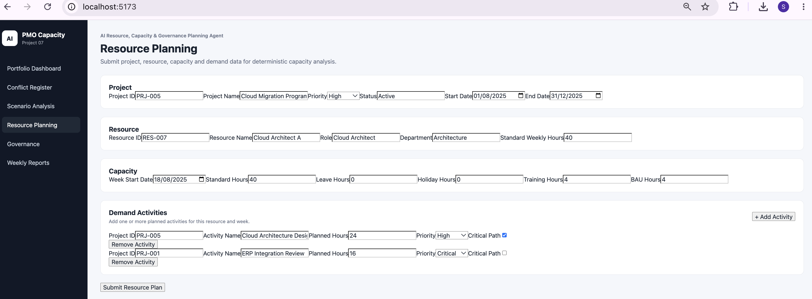

### 5. Governance Dashboard

Displays current governance decisions together with the governance audit trail.

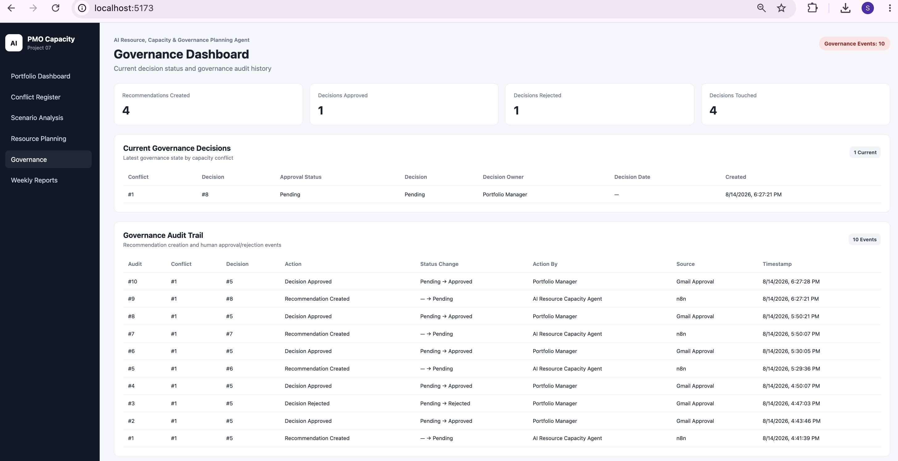

### 6. Weekly Reports

Displays persisted weekly management snapshots separately from the current live portfolio position.

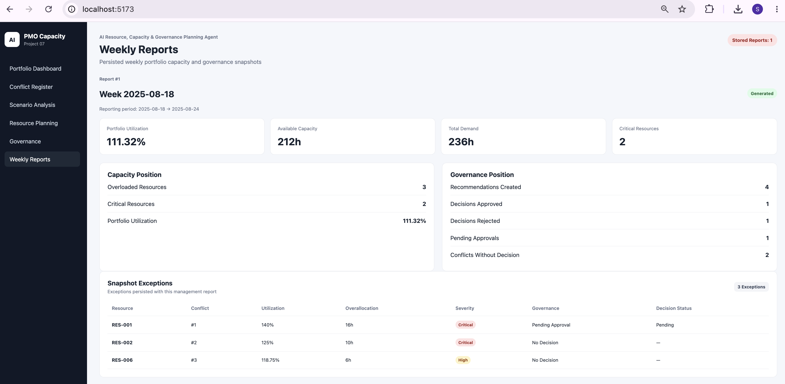

---

## n8n Workflows

### Workflow 01 — Resource Capacity Governance

Primary governance workflow for capacity conflict assessment, scenario recommendation, approval processing, and audit logging.

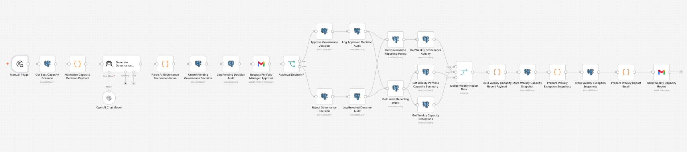

### Workflow 02 — Weekly Resource Capacity Report

Scheduled reporting workflow that consolidates capacity exceptions and governance activity, creates a weekly snapshot, stores exception details, and prepares the weekly report email.

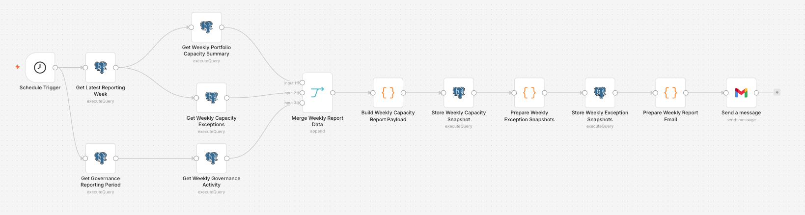

### Workflow 03 — Resource Planning Intake / Refresh

Processes new project/resource planning inputs, performs deterministic upserts, recalculates demand and capacity, and updates the conflict register.

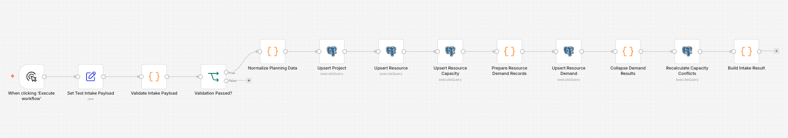

### Workflow 04 — Frontend API

Provides API endpoints used by the React frontend.

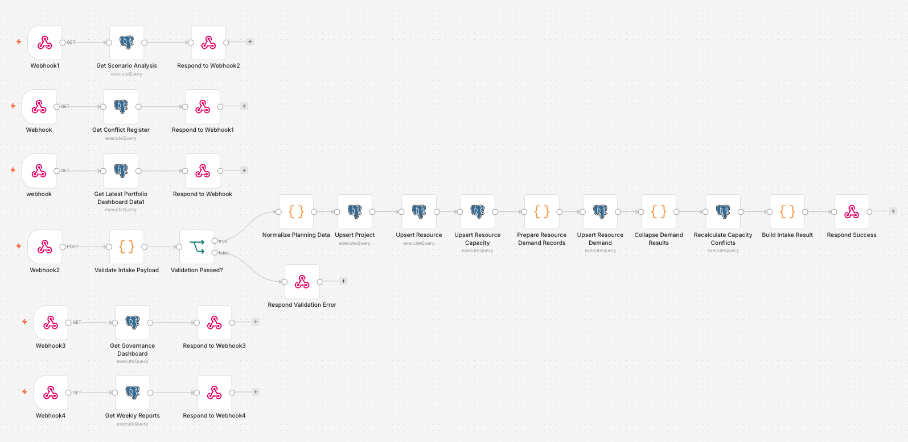

Implemented endpoints:

```text
GET  /webhook/project07/dashboard
GET  /webhook/project07/conflicts
GET  /webhook/project07/scenarios
GET  /webhook/project07/governance
GET  /webhook/project07/weekly-reports
POST /webhook/project07/resource-planning
```

---

## Data Model

Core PostgreSQL tables:

```text
projects
resources
resource_capacity
resource_demand
governance_rules
capacity_conflicts
capacity_decisions
capacity_scenarios
scenario_allocations
capacity_decision_audit
weekly_capacity_reports
weekly_capacity_report_exceptions
```

Key database views:

```text
vw_scenario_recommendations
vw_best_scenario_per_conflict
vw_weekly_resource_utilization
vw_weekly_capacity_governance
vw_weekly_portfolio_capacity_summary
```

---

## Deterministic Capacity Logic

Available resource capacity is calculated from weekly standard hours after accounting for non-project commitments.

```text
Available Hours
= Standard Hours
- Leave Hours
- Holiday Hours
- Training Hours
- BAU Hours
```

Resource utilization is calculated as:

```text
Utilization %
= Planned Demand Hours / Available Capacity Hours × 100
```

Formal capacity conflicts are raised when utilization reaches or exceeds the configured threshold.

The system uses deterministic logic for:

- Available hours
- Demand aggregation
- Utilization
- Over-allocation
- Severity
- Scenario impact
- Scenario effectiveness
- Governance scoring
- Overall scenario ranking

AI is not used to calculate these values.

---

## Scenario Analysis

The solution supports alternative mitigation scenarios for a resource-capacity conflict.

Example mitigation actions include:

- Move an activity to another week
- Reduce planned hours
- Reassign part of an activity
- Combine schedule and allocation changes

Scenarios are evaluated using deterministic metrics including:

- Baseline utilization
- Scenario utilization
- Effectiveness score
- Governance score
- Overall recommendation score
- Recommendation rank

Human approval remains required before a mitigation is accepted as a governance decision.

---

## Human-in-the-Loop Governance

The project intentionally separates recommendation from approval.

```text
System detects conflict
        ↓
System evaluates scenarios
        ↓
Recommendation created
        ↓
Human decision owner reviews
        ↓
Approve / Reject / Pending
        ↓
Decision stored
        ↓
Audit event recorded
```

This prevents the AI/automation layer from becoming the final authority for portfolio governance decisions.

---

## Weekly Snapshot Reporting

The weekly reporting workflow persists a historical management snapshot rather than only showing the current live state.

Each snapshot can include:

- Reporting period
- Total available capacity
- Total project demand
- Portfolio utilization
- Number of overloaded resources
- Number of critical resources
- Recommendations created
- Decisions approved
- Decisions rejected
- Pending approvals
- Conflicts without decisions
- Linked exception rows

This allows management reporting to preserve the state that existed when the report was generated.

---

## Technology Stack

```text
n8n
PostgreSQL 17
JavaScript
React
Vite
Node.js
npm
Docker
Gmail / Email integration
REST-style Webhooks
HTML/CSS
```

Development environment:

```text
macOS
Docker Desktop
Self-hosted n8n
PostgreSQL Docker container
React/Vite local frontend
```

---

## Local Development Environment

### Frontend

Project path:

```text
07-Resource-Capacity-Planning-Agent/frontend
```

Install dependencies:

```bash
npm install
```

Start the frontend:

```bash
npm run dev
```

Default frontend URL:

```text
http://localhost:5173
```

### n8n

The project was developed against a self-hosted n8n instance running in Docker.

Default local URL used during development:

```text
http://localhost:5678
```

### PostgreSQL

A PostgreSQL 17 Docker container was used as the primary relational data store.

Database used for Project 07:

```text
ai_resource_capacity
```

Do not commit production credentials or local passwords to the repository. Use environment variables or local configuration files excluded by `.gitignore`.

---

## Repository Structure

```text
07-Resource-Capacity-Planning-Agent/
│
├── README.md
├── .gitignore
│
├── docs/
│   ├── architecture/
│   │   └── project07-architecture.md
│   │
│   └── images/
│       ├── architecture/
│       │   └── project07-solution-architecture.png
│       │
│       ├── frontend/
│       │   ├── 01-portfolio-dashboard.png
│       │   ├── 02-conflict-register.png
│       │   ├── 03-scenario-analysis.png
│       │   ├── 04-resource-planning.png
│       │   ├── 05-governance-dashboard.png
│       │   └── 06-weekly-reports.png
│       │
│       ├── n8n/
│       │   ├── 01-resource-capacity-governance.png
│       │   ├── 02-weekly-resource-capacity-report.png
│       │   ├── 03-resource-planning-intake-refresh.png
│       │   └── 04-frontend-api.png
│       │
│       └── outputs/
│           ├── scenario-ranking-output.png
│           ├── governance-audit-output.png
│           └── weekly-report-output.png
│
├── database/
│   ├── 01-schema.sql
│   ├── 02-views.sql
│   ├── 03-governance-rules.sql
│   ├── 04-sample-data.sql
│   └── 05-validation-queries.sql
│
├── workflows/
│   ├── 01-resource-capacity-governance.json
│   ├── 02-weekly-resource-capacity-report.json
│   ├── 03-resource-planning-intake-refresh.json
│   └── 04-frontend-api.json
│
├── frontend/
│   ├── package.json
│   ├── package-lock.json
│   ├── vite.config.js
│   ├── eslint.config.js
│   ├── index.html
│   ├── public/
│   └── src/
│       ├── App.jsx
│       ├── App.css
│       ├── index.css
│       └── main.jsx
│
├── samples/
│   ├── sample-resource-planning-request.json
│   ├── sample-dashboard-response.json
│   └── sample-weekly-report-response.json
│
└── evidence/
    ├── evidence-register.md
    └── visual-asset-register.md
```

---

## Suggested GitHub Visual Sequence

For the strongest README presentation, include images in this order:

1. Solution architecture
2. Portfolio Dashboard
3. Conflict Register
4. Scenario Analysis
5. Governance Dashboard
6. Weekly Reports
7. Resource Planning
8. n8n Workflow 01 — Resource Capacity Governance
9. n8n Workflow 02 — Weekly Resource Capacity Report
10. n8n Workflow 03 — Resource Planning Intake / Refresh
11. n8n Workflow 04 — Frontend API

Avoid adding too many screenshots directly into the main README. Additional screenshots can remain under `docs/images/`.

---

## Example Demonstrated Outcome

The test portfolio demonstrated deterministic identification of multiple resource over-allocation conditions, including Critical and High-severity conflicts.

The application also demonstrated:

- Scenario-based mitigation analysis
- Ranked mitigation recommendations
- Human approval/rejection handling
- Governance audit logging
- Persisted weekly management snapshots
- Live operational frontend reporting

These results are based on the project test dataset and should not be interpreted as production enterprise performance metrics.

---

## Skills Demonstrated

- Portfolio Resource Management
- Capacity Planning
- PMO Governance
- Portfolio Management
- Scenario Analysis
- Human-in-the-Loop Decision Governance
- Workflow Automation
- Data Engineering
- Relational Database Design
- SQL
- JavaScript
- REST API Integration
- React Frontend Development
- Auditability
- Management Reporting
- AI-Assisted Decision Support

---

## Project Status

**Completed / Closed**

Project 07 demonstrates an end-to-end resource-capacity governance solution combining deterministic portfolio analytics, workflow automation, relational data management, human governance, historical reporting, and an operational frontend.

---

## Disclaimer

This project is a portfolio implementation built using test data for demonstration and learning purposes. It does not represent a live enterprise production deployment, measured organizational cost saving, or verified production performance improvement.
